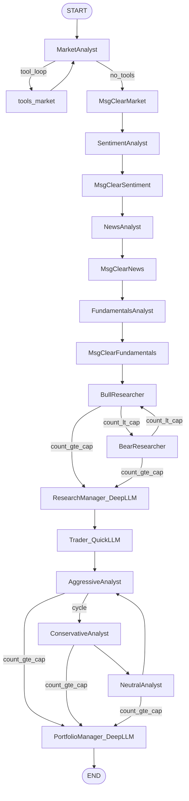
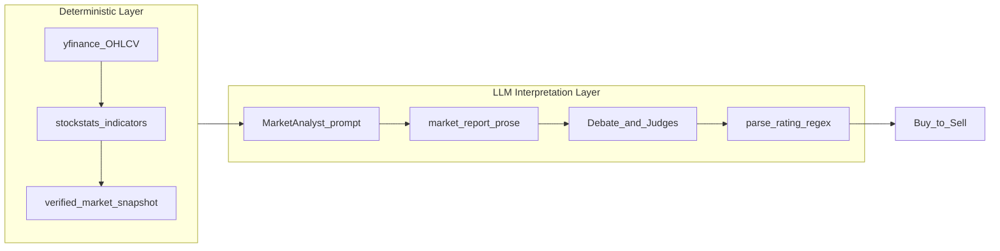
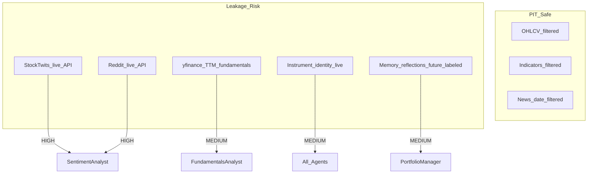

# TradingAgents v0.2.5 — Architecture & Quantitative Audit

**Audit date:** 2026-06-11  
**Repository:** TradingAgents (TauricResearch)  
**Version audited:** 0.2.5 (`pyproject.toml`)

---

## Executive Summary

TradingAgents is a **LangGraph-orchestrated multi-agent LLM research framework** that simulates the workflow of a trading desk: four specialist analysts produce reports, bull/bear researchers debate, a Research Manager synthesizes an investment plan, a Trader proposes a transaction, three risk debators critique it, and a Portfolio Manager renders a final 5-tier rating (`Buy` → `Sell`). The system is **not** a mechanical quant execution engine. Deterministic computation exists only in the data layer (OHLCV, stockstats indicators, verified snapshots); all trading signals, position sizing, stop-losses, and risk vetoes are LLM-generated prose.

**Core architectural finding:** The topology is a **hierarchical sequential pipeline with embedded debate loops** — not peer-to-peer, blackboard, or parallel fan-out. Consensus is achieved by **manager-as-judge after fixed-round debates**, not by voting, scoring, or weighted aggregation.

**Core quantitative finding:** Indicator math is sound (delegated to stockstats/Alpha Vantage), but **no coded signal rules** exist. Risk management cannot programmatically override the Trader. Historical backtests are **partially contaminated** by live sentiment feeds and TTM fundamentals. The reflection layer computes fixed-horizon long-only returns regardless of rating direction.

| Dimension | Score (1–5) | Rationale |
|-----------|:-----------:|-----------|
| **Architecture & Orchestration** | 3.5 | Clean LangGraph wiring, typed state, structured output for decision agents; dead concurrency config, CLI/propagate divergence |
| **Quantitative Validity** | 2.0 | Good OHLCV PIT guards; no mechanical signals, no risk engine, no real backtester |
| **Code Quality** | 3.5 | Strong dataflow resilience, provider capability table, 27 test modules; no async, global config mutation, missing E2E tests |
| **Production Readiness** | 2.5 | Checkpoint/memory only on `propagate()` path; no LLM rate-limit layer, no execution module despite README claims |

---

## 1. Architectural & Agent Orchestration Analysis

### 1.1 Topology Classification

The orchestration center is `TradingAgentsGraph` in `tradingagents/graph/trading_graph.py`, which compiles a `StateGraph(AgentState)` via `GraphSetup.setup_graph()` in `tradingagents/graph/setup.py`. The graph has exactly one entry point (`START`) and one exit (`END`); there are no parallel branches, fan-in joins, or external message brokers.



**Classification:** Hierarchical pipeline with two embedded **round-robin debate subgraphs**. This is closest to a staged workflow pattern (analyst → debate → judge → execute-proposal → risk-debate → final-judge), not a blackboard where agents post and subscribe to events.

Analyst wiring is explicitly sequential:

```91:109:tradingagents/graph/setup.py
        # Connect analysts in sequence
        for i, spec in enumerate(plan.specs):
            current_analyst = spec.agent_node
            current_tools = spec.tool_node
            current_clear = spec.clear_node
            ...
            if i < len(plan.specs) - 1:
                workflow.add_edge(current_clear, plan.specs[i + 1].agent_node)
            else:
                workflow.add_edge(current_clear, "Bull Researcher")
```

`analyst_concurrency_limit` is accepted by `GraphSetup.__init__` and stored in `AnalystExecutionPlan`, but **never used to parallelize**. Default is `1` in `default_config.py`; increasing it has no effect on graph topology. **[HIGH]** Misleading configuration surface.

### 1.2 Agent Roles & LLM Tiering

| README Role | Implementation | LLM Tier | Graph Node |
|-------------|----------------|----------|------------|
| Technical Analyst | Market Analyst | `quick_think_llm` | `"Market Analyst"` |
| Sentiment Expert | Sentiment Analyst (wire key `"social"`) | quick | `"Sentiment Analyst"` |
| News Analyst | News Analyst | quick | `"News Analyst"` |
| Fundamental Analyst | Fundamentals Analyst | quick | `"Fundamentals Analyst"` |
| Bull/Bear Researchers | `bull_researcher.py`, `bear_researcher.py` | quick | `"Bull Researcher"`, `"Bear Researcher"` |
| Research Manager | `research_manager.py` | **`deep_think_llm`** | `"Research Manager"` |
| Trader | `trader.py` | quick | `"Trader"` |
| Risk Management | Aggressive / Conservative / Neutral debators | quick | `"Aggressive Analyst"`, etc. |
| Portfolio Manager | `portfolio_manager.py` | **`deep_think_llm`** | `"Portfolio Manager"` |

Dual-tier LLM assignment is a deliberate cost/quality tradeoff: only the two judge nodes use the expensive model (`default_config.py` lines 56–57). All analysts, debators, and the Trader use the cheaper model.

There is **no single `RiskManager` class**. Risk is distributed across three adversarial debators plus the Portfolio Manager as final arbiter.

### 1.3 Communication Topologies

Three distinct channels carry information between agents:

#### Channel A: Typed State Bus (primary cross-phase handoff)

`AgentState` extends LangGraph's `MessagesState` with typed report fields and nested debate sub-states:

```46:75:tradingagents/agents/utils/agent_states.py
class AgentState(MessagesState):
    company_of_interest: ...
    market_report: ...
    sentiment_report: ...
    news_report: ...
    fundamentals_report: ...
    investment_debate_state: InvestDebateState
    investment_plan: ...
    trader_investment_plan: ...
    risk_debate_state: RiskDebateState
    final_trade_decision: ...
    past_context: ...
```

Downstream agents read analyst reports directly from these keys — not from `messages`. This is a **shared-memory bus** pattern: each agent writes to a named slot; later agents read the full slot contents.

#### Channel B: Messages (analyst tool loops only)

Market, News, and Fundamentals analysts bind LangChain tools and loop via conditional edges until the last message has no `tool_calls`:

```14:20:tradingagents/graph/conditional_logic.py
    def should_continue_market(self, state: AgentState):
        messages = state["messages"]
        last_message = messages[-1]
        if last_message.tool_calls:
            return "tools_market"
        return "Msg Clear Market"
```

Between analysts, `create_msg_delete()` strips all prior messages and injects an instrument-anchored placeholder. This prevents context-window bloat and avoids providers misinterpreting bare `"Continue"` prompts.

#### Channel C: Debate Sub-States (append-only histories)

Bull/Bear and risk debators append to `history` strings in `InvestDebateState` / `RiskDebateState`. Each turn increments `count`; routing logic uses `count` and `current_response`/`latest_speaker` prefix matching.

**Critique — token duplication:** Every debate round re-injects all four analyst reports verbatim. Bull researcher prompt structure:

```36:44:tradingagents/agents/researchers/bull_researcher.py
Resources available:
{instrument_context}
Market research report: {market_research_report}
Social media sentiment report: {sentiment_report}
Latest world affairs news: {news_report}
{fundamentals_label}: {fundamentals_report}
Conversation history of the debate: {history}
Last bear argument: {current_response}
```

With `max_debate_rounds=1` (default), this means 2 bull + 2 bear turns, each carrying the full report payload (~4× duplication of analyst output). Risk debators do the same — conservative debator injects all four reports plus trader plan on every turn (`conservative_debator.py` lines 16–34). **[MEDIUM]** Token inefficiency scales linearly with debate rounds.

There is **no summarization layer**, **no embedding retrieval**, and **no blackboard pub/sub** — agents cannot selectively subscribe to relevant report sections.

### 1.4 Consensus & Debate Resolution

There is **no voting, confidence scoring, or weighted consensus mechanism**.

#### Investment debate (Bull ↔ Bear)

Termination condition:

```52:61:tradingagents/graph/conditional_logic.py
    def should_continue_debate(self, state: AgentState) -> str:
        if state["investment_debate_state"]["count"] >= 2 * self.max_debate_rounds:
            return "Research Manager"
        if state["investment_debate_state"]["current_response"].startswith("Bull"):
            return "Bear Researcher"
        return "Bull Researcher"
```

With default `max_debate_rounds=1`, debate ends after 2 turns (one bull, one bear). Routing is **prefix-based on speaker label**, not content quality. The Research Manager then acts as sole judge, producing a structured `ResearchPlan` via Pydantic schema (`schemas.py`).

#### Risk debate (Aggressive → Conservative → Neutral cycle)

```63:73:tradingagents/graph/conditional_logic.py
    def should_continue_risk_analysis(self, state: AgentState) -> str:
        if state["risk_debate_state"]["count"] >= 3 * self.max_risk_discuss_rounds:
            return "Portfolio Manager"
        if state["risk_debate_state"]["latest_speaker"].startswith("Aggressive"):
            return "Conservative Analyst"
        ...
```

Default `max_risk_discuss_rounds=1` → 3 turns (one per risk persona), then Portfolio Manager judges.

#### Trader position in pipeline

The Trader sits **between** the two debates:

```
Analysts → Bull/Bear → Research Manager → Trader → Risk debators → Portfolio Manager
```

The Trader translates the 5-tier Research Manager recommendation into a 3-tier transaction proposal (`Buy` / `Hold` / `Sell`) with optional `entry_price`, `stop_loss`, and `position_sizing` fields (`TraderProposal` in `schemas.py`). Risk debators critique the trader proposal; PM synthesizes the final 5-tier rating.

**[CRITICAL] Risk override is narrative-only.** The Portfolio Manager prompt asks the LLM to "synthesize the risk analysts' debate" but imposes **no programmatic constraint** that PM must reject trades violating risk limits:

```42:64:tradingagents/agents/managers/portfolio_manager.py
        prompt = f"""As the Portfolio Manager, synthesize the risk analysts' debate and deliver the final trading decision.
...
- Research Manager's investment plan: **{research_plan}**
- Trader's transaction proposal: **{trader_plan}**
...
Be decisive and ground every conclusion in specific evidence from the analysts."""
```

There is no post-PM validation gate. An aggressive PM can ratify a trader proposal that conservative debators flagged, with no hard veto. The README claim that risk management "evaluates and adjusts trading strategies" (`README.md` line 95) is **aspirational**, not enforced in code.

### 1.5 Prompt Engineering Patterns

**No external prompt template files.** All prompts are inline f-strings or `ChatPromptTemplate` constructions inside agent factory functions (`market_analyst.py`, `bull_researcher.py`, `portfolio_manager.py`, etc.). This makes prompt versioning, A/B testing, and localization harder than a dedicated prompt registry would allow.

#### Cross-cutting prompt utilities

| Utility | Location | Purpose |
|---------|----------|---------|
| `get_language_instruction()` | `agent_utils.py` | Appends output language directive; returns `""` for English (zero token cost) |
| `get_instrument_context_from_state()` | `agent_utils.py` | Injects deterministic ticker identity on every agent turn |
| `bind_structured()` / `invoke_structured_or_freetext()` | `structured.py` | Pydantic schema enforcement with free-text fallback |
| Schema field descriptions | `schemas.py` | Double as model output instructions for decision agents |

#### Structured output layer

Decision agents (Research Manager, Trader, Portfolio Manager, Sentiment Analyst) use `llm.with_structured_output(schema)` with graceful degradation:

```48:73:tradingagents/agents/utils/structured.py
def invoke_structured_or_freetext(...):
    if structured_llm is not None:
        try:
            result = structured_llm.invoke(prompt)
            return render(result)
        except Exception as exc:
            logger.warning(
                "%s: structured-output invocation failed (%s); retrying once as free text",
                agent_name, exc,
            )
    response = plain_llm.invoke(prompt)
    return response.content
```

**[MEDIUM]** The `except Exception` catch is broad — validation errors, malformed JSON, and transient provider failures all trigger the same single free-text fallback. Downstream `parse_rating()` may then fail to extract a valid rating from unstructured prose.

Provider-specific structured-output dispatch is handled in `llm_clients/capabilities.py` and `openai_client.py` (`with_structured_output` override for models lacking `tool_choice` support).

#### Context window utilization

| Strategy | Mechanism | Effect |
|----------|-----------|--------|
| Message clearing | `create_msg_delete()` between analysts | Prevents tool-loop history accumulation |
| Report field isolation | Analyst output stored in `market_report`, etc. | Messages channel not used cross-phase |
| Sentiment pre-fetch | Data injected at turn 0, no tool loop | Saves 1–3 tool rounds vs other analysts |
| Bounded memory | `get_past_context(ticker, n_same=5, n_cross=3)` | Caps historical injection |
| Recursion limit | `max_recur_limit=100` default | Only guard against runaway tool loops |
| Long inline prompts | Market analyst carries full indicator catalog (~30 lines) | ~500+ tokens per market analyst invocation |

**Not implemented:** prompt caching (OpenAI/Anthropic), context compression/summarization, dynamic truncation, or token budget allocation across agents.

### 1.6 State Persistence

Three persistence layers exist:

#### Layer 1: Per-run JSON state logs

After `graph.invoke()`, `_log_state()` writes to `{results_dir}/{ticker}/TradingAgentsStrategy_logs/full_states_log_{date}.json` containing all reports, debate histories, plans, and final decision (`trading_graph.py` lines 414–454).

#### Layer 2: Markdown memory log with deferred reflection

`TradingMemoryLog` (`agents/utils/memory.py`) maintains an append-only log at `~/.tradingagents/memory/trading_memory.md`:

- **Phase A (end of run):** `store_decision()` appends a pending entry with rating tag parsed by `parse_rating()`.
- **Phase B (start of next same-ticker run):** `_resolve_pending_entries()` fetches 5-day returns, calls `Reflector.reflect_on_final_decision()`, writes reflection back.

`get_past_context()` injects resolved entries into `past_context` at run start — consumed primarily by Portfolio Manager.

#### Layer 3: LangGraph SQLite checkpoints (optional)

When `checkpoint_enabled=True`, per-ticker SQLite DB at `{data_cache_dir}/checkpoints/{TICKER}.db`. Thread ID = SHA256 of `{ticker}:{date}`. Cleared on successful completion.

#### **[CRITICAL] CLI vs programmatic path divergence**

The CLI (`cli/main.py`) builds state and streams the graph directly, **bypassing `propagate()`**:

```1116:1135:cli/main.py
        init_agent_state = graph.propagator.create_initial_state(
            selections["ticker"],
            selections["analysis_date"],
            asset_type=selections["asset_type"],
            instrument_context=instrument_context,
        )
        ...
        for chunk in graph.graph.stream(init_agent_state, **args):
```

Consequences of this bypass:

| Feature | `propagate()` path | CLI path |
|---------|-------------------|----------|
| `past_context` injection | Yes (`memory_log.get_past_context`) | **No** — `past_context` defaults to `""` |
| `memory_log.store_decision()` | Yes | **No** |
| `_resolve_pending_entries()` | Yes (pre-run) | **No** |
| Checkpoint recompile | Yes (`get_checkpointer`) | **No** — `checkpoint_enabled` set but graph never recompiled |
| JSON state log (`_log_state`) | Yes | **No** — CLI writes markdown reports separately |

`checkpoint_enabled` is assigned at CLI line 1008 but never triggers `get_checkpointer()` or graph recompilation. **[CRITICAL]** Primary user entry point (`tradingagents` CLI) does not exercise half the persistence/reflection infrastructure.

---

## 2. Quantitative Trading Strategy Audit

### 2.1 Signal Generation Architecture

TradingAgents separates **data computation** (deterministic) from **signal interpretation** (LLM-only). There is no intermediate rule engine.



#### Deterministic indicator computation

Indicators are computed via stockstats `wrap()` on OHLCV filtered to `curr_date`:

```65:125:tradingagents/dataflows/stockstats_utils.py
def load_ohlcv(symbol: str, curr_date: str) -> pd.DataFrame:
    """Fetch OHLCV data with caching, filtered to prevent look-ahead bias."""
    ...
    # Filter to curr_date to prevent look-ahead bias in backtesting
    data = data[data["Date"] <= curr_date_dt]
```

Supported indicators (yfinance path): `close_50_sma`, `close_200_sma`, `close_10_ema`, `macd`, `macds`, `macdh`, `rsi`, `boll`, `boll_ub`, `boll_lb`, `atr`, `vwma`, `mfi`.

Bulk calculation in `_get_stock_stats_bulk()` computes indicators across the full filtered history at once, then maps date → value. This is mathematically correct for rolling indicators as long as the input series is PIT-filtered (which it is).

`build_verified_market_snapshot()` (`market_data_validator.py`) provides a deterministic ground-truth table the market analyst is instructed to treat as authoritative for exact numeric claims — a strong anti-hallucination measure introduced for issue #830.

#### Signal layer: prompt folklore only

The market analyst system prompt describes trading heuristics in natural language:

```37:38:tradingagents/agents/analysts/market_analyst.py
Momentum Indicators:
- rsi: RSI: Measures momentum to flag overbought/oversold conditions. Usage: Apply 70/30 thresholds and watch for divergence to signal reversals.
```

There is **no code** that:
- Detects RSI crossing 30/70
- Identifies MACD signal-line crossovers
- Computes golden/death cross events
- Generates a structured `{signal: BUY, strength: 0.7, indicator: "rsi"}` object

The **only deterministic downstream signal** is `parse_rating()` — a regex heuristic on Portfolio Manager prose:

```30:50:tradingagents/agents/utils/rating.py
def parse_rating(text: str, default: str = "Hold") -> str:
    for line in text.splitlines():
        m = _RATING_LABEL_RE.search(line)
        if m and m.group(1).lower() in _RATING_SET:
            return m.group(1).capitalize()
    ...
    return default
```

**Assessment:** Indicator math is sound (standard stockstats definitions). Trading rules exist only as LLM prompt guidance with **no backtested mechanical edge**, no information coefficient measurement, and no signal attribution.

### 2.2 Risk Management Constraints

| Capability | Status | Implementation |
|------------|--------|----------------|
| Stop-loss | Optional LLM field | `TraderProposal.stop_loss: Optional[float]` |
| Position sizing | Optional prose | `TraderProposal.position_sizing: Optional[str]` e.g. `'5% of portfolio'` |
| Entry price | Optional LLM field | `TraderProposal.entry_price: Optional[float]` |
| VaR / CVaR | **Absent** | — |
| Max drawdown limits | **Absent** | — |
| Portfolio heat / correlation | **Absent** | — |
| Kelly criterion | **Absent** | — |
| Volatility targeting | **Absent** | — |
| ATR-based stops | Prompt guidance only | Market analyst describes ATR usage; no `stop = entry - N×ATR` computation |
| Order execution | **Absent** | README line 96 claims "simulated exchange" — no execution module exists |

Risk debators produce conversational arguments. The conservative debator's objective is stated in prompt prose ("protect assets, minimize volatility") but there is no validation that its recommendations influence the PM output.

**Can risk realistically override the Trader?** Only if the Portfolio Manager LLM chooses to side with conservative arguments. There is no:
- Hard veto function
- Risk budget check against account equity
- Comparison of `stop_loss` distance vs ATR
- Parsing/validation of `position_sizing` strings against config limits

**[CRITICAL]** For production trading, this architecture cannot enforce risk constraints. It can only *suggest* them in natural language.

### 2.3 Look-Ahead Bias, Data Leakage & Hallucination

#### Protections implemented

| Guard | Location | Mechanism |
|-------|----------|-----------|
| OHLCV PIT filter | `stockstats_utils.py:122-123` | `data[data["Date"] <= curr_date_dt]` |
| Financial statement PIT | `filter_financials_by_date()` | Drop fiscal periods after `curr_date` |
| Alpha Vantage indicators | `alpha_vantage_indicator.py` | Date window `before <= date <= curr_date` |
| Ticker news date filter | `yfinance_news.py` | Filter by `pub_date` within `[start_date, end_date]` |
| Global news cutoff | `yfinance_news.py` | Skip articles published after `curr_date` |
| No-data sentinel | `interface.py` | `NO_DATA_AVAILABLE` prevents fabrication |
| Verified snapshot | `market_data_validator.py` | Deterministic OHLCV + indicator table |
| Instrument identity | `agent_utils.py` | `resolve_instrument_identity()` anchors ticker to real entity |
| Sentiment redesign | `sentiment_analyst.py` | Pre-fetch replaces tool-calling that caused Reddit fabrication (#557, #796) |

Market analyst prompt explicitly forbids inventing bounces or percentage moves without tool support (lines 51–52).

#### Remaining leakage risks



| Risk | Severity | Detail |
|------|----------|--------|
| StockTwits live fetch | **[HIGH]** | `fetch_stocktwits_messages(ticker, limit=30)` — no `trade_date` parameter (`sentiment_analyst.py:70`) |
| Reddit live fetch | **[HIGH]** | `fetch_reddit_posts(ticker)` — no historical filter (`sentiment_analyst.py:71`) |
| yfinance fundamentals TTM | **[MEDIUM]** | `get_fundamentals` annotated `curr_date (not used for yfinance)` (`y_finance.py:260`) |
| Instrument identity | **[MEDIUM]** | `yf.Ticker(ticker).info` is live snapshot, not PIT |
| OHLCV cache file | **[LOW]** | Cache downloads through today, filtered at read time — safe for analysis, impure cache artifact |
| Memory reflections | **[MEDIUM]** | Outcome-labeled reflections injected into PM contain future knowledge relative to original `trade_date` if re-running historical dates |
| LLM non-determinism | **Inherent** | Temperature, reasoning models, debate sampling — documented in README |

Running `propagate("NVDA", "2024-05-10")` today will inject **current** StockTwits/Reddit sentiment into a May 2024 analysis. This invalidates historical event studies for any strategy relying on sentiment input.

### 2.4 Backtesting & Outcome Evaluation

**No vectorized backtester exists.** Dependencies `backtrader>=1.9.78.123` and `redis>=6.2.0` are declared in `pyproject.toml` but have **zero imports** in the codebase.

What exists:

1. **Single-date analysis:** `TradingAgentsGraph.propagate(ticker, trade_date)` 
2. **Deferred outcome labeling:** `_fetch_returns()` computes fixed-horizon returns
3. **LLM reflection:** `Reflector.reflect_on_final_decision()` generates lessons from known outcomes

#### Mathematical critique of `_fetch_returns`

```246:256:tradingagents/graph/trading_graph.py
            actual_days = min(holding_days, len(stock) - 1, len(bench) - 1)
            raw = float(
                (stock["Close"].iloc[actual_days] - stock["Close"].iloc[0])
                / stock["Close"].iloc[0]
            )
            bench_ret = float(
                (bench["Close"].iloc[actual_days] - bench["Close"].iloc[0])
                / bench["Close"].iloc[0]
            )
            alpha = raw - bench_ret
```

Properties of this formula:

- **Always long:** Computes buy-and-hold return regardless of `Buy`/`Sell`/`Hold` rating
- **Fixed horizon:** `holding_days=5` default; not tied to PM `time_horizon` field
- **No transaction costs:** Zero slippage, zero commission
- **No shorting:** Sell ratings are not mapped to short positions
- **No position sizing:** Ignores `TraderProposal.position_sizing`
- **Alpha = raw - benchmark:** Simple difference, not beta-adjusted (no CAPM residual)

This is **decision journaling with ex-post P&L labeling**, not strategy backtesting. You cannot compute Sharpe ratio, max drawdown, information coefficient, or hit rate from this infrastructure without building an external harness.

### 2.5 Execution Latency Vulnerability

The framework has **no execution layer** — no order routing, no latency model, no fill simulation. The README's "simulated exchange" (line 96) is conceptual only.

For live deployment, the sequential pipeline implies:
- Wall time ≈ Σ(analyst tool loops) + Σ(debate rounds) + 3 decision LLM calls
- Typical run: 4 analysts × (1–5 tool rounds each) + 2 debate turns + 1 RM + 1 Trader + 3 risk turns + 1 PM ≈ **15–30+ LLM invocations**
- No streaming partial decisions; no early-exit on high-confidence signals
- Data fetches (yfinance, StockTwits, Reddit) are synchronous and sequential within each analyst

**[MEDIUM]** For intraday or event-driven strategies, this latency profile is incompatible with time-sensitive execution. The framework is designed for end-of-day research decisions.

---

## 3. Code Quality, Concurrency & Performance Review

### 3.1 Asynchronous Execution

**Finding: Fully synchronous.** No `async`/`asyncio` usage in application code. All LLM calls use blocking `.invoke()`; graph execution uses `.invoke()` or `.stream()`. Data fetches in `stockstats_utils.py`, `reddit.py`, `stocktwits.py` are blocking HTTP.

Implications:
- Analyst wall time is strictly additive (4 analysts sequential by default)
- No concurrent data pre-fetching across analysts
- `analyst_concurrency_limit` config is dead code in graph wiring

The only threading is defensive: `StatsCallbackHandler` in `cli/stats_handler.py` uses `threading.Lock()` for callback counter updates.

### 3.2 Error Handling & Retry Logic

| Layer | Behavior | Assessment |
|-------|----------|------------|
| yfinance | `yf_retry()` — exponential backoff on `YFRateLimitError`, 3 retries | **[GOOD]** |
| Alpha Vantage | Vendor fallback on `AlphaVantageRateLimitError` | **[GOOD]** |
| Reddit | Inter-request delay, JSON→RSS fallback | **[GOOD]** |
| LLM APIs | Passthrough `max_retries`/`timeout` to LangChain — **not set in DEFAULT_CONFIG** | **[MEDIUM]** |
| Structured output | Single free-text fallback on any `Exception` | **[MEDIUM]** |
| Graph invoke | No `try/except` wrapper — mid-run failure propagates uncaught | **[HIGH]** |
| Instrument identity | Fail-open: `except Exception` → return `{}` | **[LOW]** acceptable |
| `_fetch_returns` | Broad `except Exception` → log warning, return `None` | **[LOW]** deferred retry |

**[HIGH]** No application-level handling for HTTP 429 from LLM providers. A rate-limited OpenAI/Anthropic call during a debate round kills the entire run. Checkpoint resume (on `propagate()` path only) is the only recovery mechanism.

Tool loops are bounded only by `recursion_limit=100` (`default_config.py:82`). A misbehaving analyst that repeatedly calls tools will fail late with a LangGraph recursion error, not a graceful per-node timeout.

### 3.3 Race Conditions & Concurrency Safety

| Area | Risk | Severity |
|------|------|----------|
| Memory log writes | Append via `open(..., "a")`; `batch_update_with_outcomes` uses tmp+replace but **no file locking** | **[MEDIUM]** |
| Global `_config` | Module-level mutable dict in `dataflows/config.py`; `set_config()` called in `TradingAgentsGraph.__init__` | **[MEDIUM]** |
| Checkpoint DB | Per-ticker SQLite reduces cross-ticker contention; same ticker+date concurrent runs could conflict | **[LOW]** |
| Results JSON | Per-date file per ticker — safe unless duplicate concurrent runs | **[LOW]** |

`get_config()` returns `deepcopy(_config)` — readers are safe, but `set_config()` during concurrent graph runs in the same process would race.

### 3.4 Token Cost Efficiency

**Optimizations present:**
- Dual LLM tiers (cheap for 10+ nodes, expensive for 2 judges)
- Message clearing between analysts
- Sentiment pre-fetch (single LLM call vs multi-round tools)
- Regex `parse_rating()` instead of second LLM for signal extraction
- Bounded memory injection (5 same + 3 cross ticker)
- `get_language_instruction()` returns `""` for English
- Configurable `news_article_limit` / `global_news_article_limit`

**Inefficiencies:**
- Full analyst reports re-injected every debate round (see §1.3)
- Market analyst system prompt carries ~30-line inline indicator catalog on every invocation
- No prompt caching (OpenAI/Anthropic cache APIs)
- Reflection runs sequential LLM calls in `_resolve_pending_entries()` before each `propagate()`
- Debug mode streams and pretty-prints every chunk (CLI always runs `debug=True`)

Estimated token budget per full run (4 analysts, depth=1): **50,000–150,000 tokens** depending on tool loop depth and report verbosity. Debate rounds are the primary multiplier.

### 3.5 Dependency Management

**Manifest:** `pyproject.toml` (Python ≥3.10, managed via `uv.lock`).

| Package | Role | Notes |
|---------|------|-------|
| `langgraph`, `langgraph-checkpoint-sqlite` | Workflow + resume | Core |
| `langchain-*` | LLM abstraction | 4 provider packages |
| `pandas`, `yfinance`, `stockstats` | Market data | Core |
| `pydantic` | Structured output schemas | Transitive + direct |
| `typer`, `rich`, `questionary` | CLI | |
| `redis>=6.2.0` | **Unused** | Zero imports in codebase |
| `backtrader>=1.9.78.123` | **Unused** | Zero imports in codebase |

**[LOW]** Dead dependencies add install weight and imply unfinished features.

### 3.6 Test Coverage

~27 test modules under `tests/`. Markers: `unit`, `integration`, `smoke`.

**Well-covered:**
- Memory log (`test_memory_log.py` — ~68 tests)
- Structured agents (`test_structured_agents.py`)
- LLM capabilities (`test_capabilities.py`, provider-specific tests)
- Dataflows (`test_no_data_handling.py`, `test_market_data_validator.py`, `test_symbol_utils.py`)
- Signal processing (`test_signal_processing.py`)
- Checkpoint utilities (`test_checkpoint_resume.py` — toy graph, not full TradingAgents graph)

**Gaps (severity-rated):**

| Gap | Severity |
|-----|----------|
| No E2E test of `TradingAgentsGraph` with mocked LLM | **[HIGH]** |
| CLI/propagate parity untested | **[HIGH]** |
| `GraphSetup` / `ConditionalLogic` routing untested | **[MEDIUM]** |
| Individual analyst tool-loop agents untested | **[MEDIUM]** |
| Risk debator agents untested | **[MEDIUM]** |
| `analyst_concurrency_limit > 1` behavior untested (would document dead config) | **[LOW]** |
| No coverage tooling configured in pyproject | **[LOW]** |

### 3.7 Extensibility

**Well-designed patterns:**
- LLM provider factory (`llm_clients/factory.py`) with lazy imports
- Capability table (`capabilities.py`) for model-specific quirks
- Data vendor routing (`dataflows/interface.py`) with category + tool-level overrides
- Analyst execution registry (`analyst_execution.py` — `ANALYST_NODE_SPECS`)
- Env-var config overrides (`default_config.py` — `_ENV_OVERRIDES`)

**Friction:** Adding a new analyst type requires coordinated edits in ≥6 files:
1. `analyst_execution.py` — register in `ANALYST_NODE_SPECS`
2. `graph/setup.py` — factory dict + edges
3. `conditional_logic.py` — `should_continue_{key}()`
4. `trading_graph.py` — `_create_tool_nodes()`
5. `cli/models.py` — `AnalystType` enum
6. `cli/main.py` — `ANALYST_MAPPING`

No plugin registry or discovery mechanism exists.

---

## 4. Actionable Improvement Roadmap

### Tier 1 — High Impact, Moderate Effort (1–3 weeks each)

#### 1.1 Wire analyst parallelism via LangGraph `Send`

**Problem:** `analyst_concurrency_limit` is stored but unused; 4 analysts run sequentially.  
**Solution:** After `START`, fan out with `Send` API to run independent analysts concurrently; join before Bull Researcher. Honor `analyst_concurrency_limit` as a semaphore.  
**Impact:** 2–4× wall-time reduction for analyst phase.  
**Files:** `setup.py`, `analyst_execution.py`, new join node.

#### 1.2 Unify CLI and `propagate()` paths

**Problem:** CLI bypasses memory log, `past_context`, checkpoints, and JSON state logging.  
**Solution:** Route `cli/main.py` through `graph.propagate()` with a streaming callback adapter for the Rich TUI.  
**Impact:** Feature parity; reflection loop works from CLI.  
**Files:** `cli/main.py`, `trading_graph.py` (add streaming hook).

#### 1.3 Point-in-time sentiment guard

**Problem:** StockTwits/Reddit fetch live data regardless of `trade_date`.  
**Solution:** (a) Add `trade_date` parameter to fetchers; reject/disable social sources when `trade_date < today - 1 day`. (b) Long-term: integrate historical sentiment archive (e.g., StockTwits API with date filter, Pushshift for Reddit).  
**Impact:** Enables valid historical backtests for sentiment-inclusive runs.  
**Files:** `sentiment_analyst.py`, `stocktwits.py`, `reddit.py`.

#### 1.4 Programmatic risk veto layer

**Problem:** PM can ratify any trader proposal regardless of risk debate.  
**Solution:** Post-PM validation function:
```python
def validate_risk_constraints(trader_proposal, market_snapshot, config) -> list[str]:
    violations = []
    if trader_proposal.stop_loss and trader_proposal.entry_price:
        atr = market_snapshot["atr"]
        if abs(entry - stop) > config["max_stop_atr_multiple"] * atr:
            violations.append(f"Stop distance {dist:.2f} exceeds {max_mult}×ATR")
    # Parse position_sizing against config["max_position_pct"]
    return violations
```
If violations exist, re-invoke PM with constraint context or force `Hold`.  
**Impact:** First mechanical risk enforcement in the pipeline.  
**Files:** New `risk_validator.py`, `portfolio_manager.py`, `default_config.py`.

#### 1.5 Mechanical signal reconciliation layer

**Problem:** RSI 70/30, MACD crosses exist only in prompts.  
**Solution:** Add `compute_mechanical_signals(ohlcv_df) -> SignalBundle` that detects crossovers, threshold breaches, and trend regime. Inject as structured JSON into market analyst context; prompt requires explicit reconciliation ("mechanical signals say X, my assessment is Y because...").  
**Impact:** Auditable signal provenance; foundation for backtesting.  
**Files:** New `signals/mechanical.py`, `market_analyst.py`.

### Tier 2 — Quantitative Strategy Enhancements (2–6 weeks each)

#### 2.1 Regime detection module

Feed Research Manager a structured `RegimeState` object:
- VIX level and term structure (contango/backwardation)
- Yield curve slope (10Y–2Y spread)
- Simple HMM or volatility-regime classifier on trailing returns

Enables regime-conditioned position sizing recommendations.

#### 2.2 Confidence-weighted consensus scoring

Replace fixed-round debates with structured analyst outputs:
```python
class AnalystSignal(BaseModel):
    direction: Literal["bullish", "bearish", "neutral"]
    confidence: float  # 0.0–1.0
    key_evidence: list[str]
```
Research Manager receives `list[AnalystSignal]` and computes weighted score before generating `ResearchPlan`. Debate rounds become optional depth, not the sole consensus mechanism.

#### 2.3 Event-study backtest harness

```python
for date in trading_days(start, end):
    state, rating = graph.propagate(ticker, date)
    position = rating_to_position(rating)  # Buy=+1, Sell=-1, Hold=0
    returns.append(position * forward_return(ticker, date, horizon))
```
Compute: IC (rating vs forward return), Sharpe, max DD, hit rate, turnover. Add transaction cost model (configurable bps).

#### 2.4 Point-in-time fundamentals

Integrate SEC EDGAR XBRL or a PIT vendor (Compustat, FactSet). Filter `get_fundamentals` output by `trade_date`. Until then, document fundamentals as "latest TTM snapshot" and exclude from historical backtests.

### Tier 3 — Engineering Hardening (1–2 weeks each)

| # | Recommendation | Effort | Impact |
|---|---------------|--------|--------|
| 3.1 | Application-level LLM retry with exponential backoff on 429/5xx | 1 week | **[HIGH]** run resilience |
| 3.2 | Async data pre-fetch (`asyncio.gather` for OHLCV, news, fundamentals before analyst phase) | 1 week | **[MEDIUM]** latency |
| 3.3 | Analyst plugin registry (single `register_analyst()` instead of 6-file edits) | 2 weeks | **[MEDIUM]** extensibility |
| 3.4 | Remove or implement `redis`/`backtrader` deps | 1 day | **[LOW]** hygiene |
| 3.5 | Memory log file locking (`portalocker` or `fcntl.flock`) | 2 days | **[MEDIUM]** concurrency safety |
| 3.6 | E2E integration test: mock LLM + real dataflows through full graph | 1 week | **[HIGH]** regression safety |
| 3.7 | Per-node timeout + graceful degradation (skip analyst on timeout, mark report as unavailable) | 1 week | **[MEDIUM]** resilience |
| 3.8 | Prompt template externalization (Jinja2/YAML in `prompts/` directory) | 1 week | **[LOW]** maintainability |

---

## 5. Summary Scorecard

| Dimension | Score | Key Strength | Key Weakness |
|-----------|:-----:|-------------|-------------|
| Architecture & Orchestration | **3.5 / 5** | Clean LangGraph pipeline, typed state, dual LLM tiers | Dead concurrency config, CLI/propagate split, no consensus scoring |
| Quantitative Validity | **2.0 / 5** | PIT OHLCV guards, verified snapshot, anti-fabrication sentinels | No mechanical signals, no risk engine, sentiment leakage, no real backtester |
| Code Quality | **3.5 / 5** | Provider capability table, data vendor fallback, 27 test modules | Fully synchronous, global config mutation, broad exception catches |
| Production Readiness | **2.5 / 5** | Checkpoint resume, memory log, structured output | CLI missing half the infrastructure, no LLM rate limits, no execution layer |

**Bottom line:** TradingAgents is a well-engineered **multi-agent qualitative research scaffold** with thoughtful data-layer hardening (verified snapshots, PIT OHLCV, vendor fallback). It is **not** a production quantitative trading system. The gap between README marketing ("simulated exchange," "risk management team evaluates and adjusts") and code reality (no execution, no risk veto, no mechanical signals) is the primary risk for users treating outputs as tradeable alpha.

To evolve toward production-grade quant infrastructure, prioritize: (1) CLI/propagate unification, (2) PIT sentiment guard, (3) mechanical signal layer, (4) programmatic risk veto, and (5) event-study backtest harness. These five changes transform the framework from an LLM research demo into a testable, auditable decision system.

---

*Report generated by architecture audit of TradingAgents v0.2.5. All file paths relative to repository root.*
