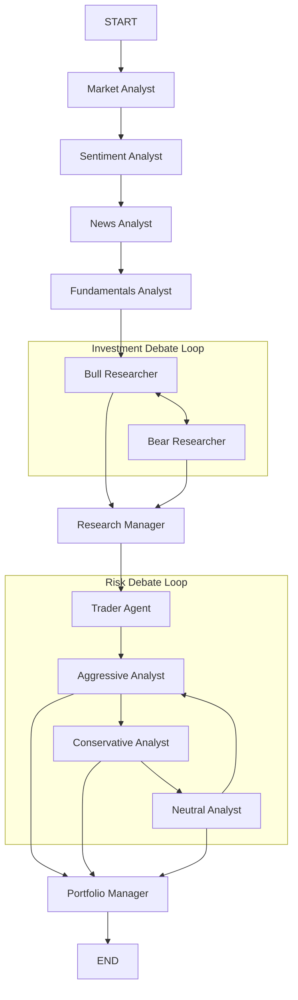
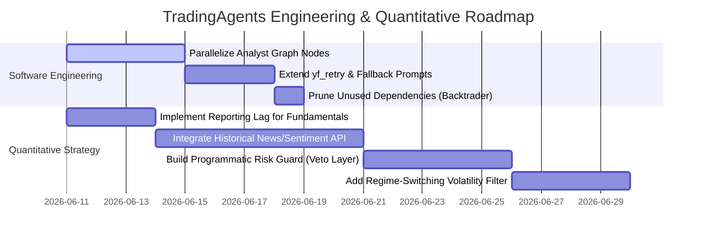

# TradingAgents Codebase Architecture Audit & Quantitative Review

## Executive Summary
This report presents a rigorous, production-grade architectural audit and quantitative review of the **TradingAgents** multi-agent LLM trading framework. TradingAgents uses a LangGraph-driven state machine to coordinate specialized agents (Fundamental, Sentiment, Technical, and News Analysts) with a Researcher debate team (Bull vs. Bear) and a Risk Management group (Aggressive, Conservative, Neutral) led by a Portfolio Manager.

While the software engineering quality of the repository is exceptionally high—featuring robust unit test coverage, structured Pydantic input/output parsing with resilient fallbacks, and memory-log checkpointing—the audit has uncovered several critical architectural bottlenecks and quantitative validity issues:
1. **Sequential Analyst Execution Bottleneck:** Despite configuration parameters for concurrency, the graph statically chains independent analyst nodes in series, introducing significant execution latency.
2. **Severe Look-Ahead Bias in Fundamentals:** The date-filtering mechanism for corporate financials filters columns by fiscal period end dates rather than actual publication dates, introducing reporting-lag bias.
3. **Temporal Misalignment & Information Starvation in News/Sentiment:** APIs for news and social sentiment (Reddit, StockTwits) do not support historical date queries. Backtesting historical dates results in either "information starvation" (zero data) or "look-ahead bias" (using 2026 sentiment to trade in 2023).
4. **Qualitative Risk Management Overrides:** Risk controls are entirely soft, prompt-based, and lack programmatic veto power or quantitative calculations (e.g., Value-at-Risk, Kelly Criterion sizing).

---

## 1. Architectural & Agent Orchestration Analysis

### LangGraph State Machine & Communication Topologies
The framework is built around a LangGraph state machine, compiled in [setup.py](file:///Users/dn/codeai/TradingAgents/tradingagents/graph/setup.py) and executed via `TradingAgentsGraph` in [trading_graph.py](file:///Users/dn/codeai/TradingAgents/tradingagents/graph/trading_graph.py). 

The state is tracked via the `AgentState` Pydantic class:
```python
class AgentState(MessagesState):
    company_of_interest: Annotated[str, "Company that we are interested in trading"]
    asset_type: Annotated[str, "Asset type under analysis such as stock or crypto"]
    instrument_context: Annotated[str, "Deterministic ticker identity resolved at run start"]
    trade_date: Annotated[str, "What date we are trading at"]
    sender: Annotated[str, "Agent that sent this message"]
    market_report: Annotated[str, "Report from the Market Analyst"]
    sentiment_report: Annotated[str, "Report from the Sentiment Analyst"]
    news_report: Annotated[str, "Report from the News Researcher of current world affairs"]
    fundamentals_report: Annotated[str, "Report from the Fundamentals Researcher"]
    investment_debate_state: Annotated[InvestDebateState, "Current state of the debate on if to invest or not"]
    investment_plan: Annotated[str, "Plan generated by the Analyst"]
    trader_investment_plan: Annotated[str, "Plan generated by the Trader"]
    risk_debate_state: Annotated[RiskDebateState, "Current state of the debate on evaluating risk"]
    final_trade_decision: Annotated[str, "Final decision made by the Risk Analysts"]
    past_context: Annotated[str, "Memory log context injected at run start"]
```

The system topology uses a hybrid structure:
1. **Pipeline (Sequential Analysts):** Independent analysts generate textual reports (`market_report`, `sentiment_report`, etc.) and store them in the state.
2. **Discussion Loop (Peer-to-Peer Debate):** Bull and Bear researchers argue back-and-forth about the company's prospects.
3. **Hierarchy (Judge/PM):** Managers act as central arbiters. The `Research Manager` judges the Bull/Bear debate, the `Trader` proposes a transaction, the Risk Analysts debate it, and the `Portfolio Manager` acts as the final decision authority.



### The Analyst Concurrency Bottleneck
A major architectural flaw resides in the analyst execution phase in [setup.py](file:///Users/dn/codeai/TradingAgents/tradingagents/graph/setup.py#L89-L109):
```python
# Start with the first analyst
workflow.add_edge(START, plan.specs[0].agent_node)

# Connect analysts in sequence
for i, spec in enumerate(plan.specs):
    current_analyst = spec.agent_node
    current_tools = spec.tool_node
    current_clear = spec.clear_node

    workflow.add_conditional_edges(
        current_analyst,
        getattr(self.conditional_logic, f"should_continue_{spec.key}"),
        [current_tools, current_clear],
    )
    workflow.add_edge(current_tools, current_analyst)

    # Connect to next analyst or to Bull Researcher if this is the last analyst
    if i < len(plan.specs) - 1:
        workflow.add_edge(current_clear, plan.specs[i + 1].agent_node)
    else:
        workflow.add_edge(current_clear, "Bull Researcher")
```
This compilation wires the analysts in a strictly sequential chain. While `DEFAULT_CONFIG` defines `analyst_concurrency_limit = 1`, and the code accepts this parameter, the LangGraph edges are hardcoded in series. Because the analysts execute independent tool calls and LLM invocations, they have zero data dependencies on each other. Chaining them sequentially multiplies the total wall-clock time linearly:
$$\text{Latency}_{\text{total}} = \sum_{k=1}^{N} (\text{Latency}_{\text{LLM}, k} + \text{Latency}_{\text{Tool}, k})$$
In production-grade systems, these nodes should run in parallel using LangGraph fan-out and fan-in, dropping latency to $\max_{k} (\text{Latency}_{k})$.

### Debate-Resolution & Consensus Mechanism
The framework resolves consensus through two manager/judge nodes:
- **Research Manager:** Evaluates the transcript of the Bull/Bear debate and assigns a structured rating based on a 5-tier scale (Buy, Overweight, Hold, Underweight, Sell).
- **Portfolio Manager:** Resolves the Risk debate. It evaluates the Research Manager's rating, the Trader's transaction proposal (Buy/Hold/Sell with price targets and stop-losses), and the Aggressive/Conservative/Neutral risk debate transcript to make the final position-sizing and entry/exit decision.

This debate-resolution protocol utilizes reasoning LLMs (like GPT-5.5) to synthesize conflicts. It succeeds in preventing one-sided LLM bias by forcing opposing views into the context window. However, there is no mathematical formulation or scoring mechanism (e.g., voting weights, consensus metrics, or bayesian probability updating) to guide the decision; it remains a qualitative text synthesis.

### State Persistence, Context Windows, & Memory Logs
The framework manages state and tokens using two notable techniques:
1. **State Message Truncation:** To prevent context bloating, the framework uses a clear node (`Msg Clear <Analyst>`) after each analyst node. In `create_msg_delete` ([agent_utils.py](file:///Users/dn/codeai/TradingAgents/tradingagents/agents/utils/agent_utils.py#L166-L190)), it deletes the messages history and replaces it with a placeholder human message:
   ```python
   removal_operations = [RemoveMessage(id=m.id) for m in messages]
   placeholder = HumanMessage(content=f"Proceed with your assigned analysis... {instrument_context}")
   return {"messages": removal_operations + [placeholder]}
   ```
   This is a highly efficient pattern. The massive CSV tables and indicator dumps returned by tools are kept out of the central message history. Downstream agents only ingest the concise, summarized markdown reports stored in `market_report`, `sentiment_report`, etc.
2. **Append-Only Memory Log and Reflections:** The class `TradingMemoryLog` ([memory.py](file:///Users/dn/codeai/TradingAgents/tradingagents/agents/utils/memory.py)) manages a persistent markdown file (`trading_memory.md`). At the end of a run, it records the decision as `pending`. When the ticker is run again on a later date, it fetches the historical returns (raw and alpha vs. a benchmark) for that period, uses the `Reflector` to generate a critique, updates the markdown file, and feeds the most recent same-ticker decisions and cross-ticker lessons back into the Portfolio Manager's prompt as context. This serves as a local, lightweight in-context reinforcement learning loop.

---

## 2. Quantitative Trading Strategy Audit

### Technical Indicators Mechanics
The `Market Analyst` ([market_analyst.py](file:///Users/dn/codeai/TradingAgents/tradingagents/agents/analysts/market_analyst.py)) and the underlying `stockstats` wrapper calculate standard technical indicators: 50-day and 200-day SMA, 10-day EMA, MACD, RSI, Bollinger Bands, ATR, and VWMA. 

The indicators are calculated on-the-fly from historical OHLCV data. The data loader (`load_ohlcv` in [stockstats_utils.py](file:///Users/dn/codeai/TradingAgents/tradingagents/dataflows/stockstats_utils.py#L65-L125)) downloads up to 5 years of historical data from Yahoo Finance and caches it. To prevent look-ahead bias, it filters the data before sending it to the indicator generator:
```python
# Filter to curr_date to prevent look-ahead bias in backtesting
data = data[data["Date"] <= curr_date_dt]
```
This represents a clean historical boundary for technical indicators: the indicators calculated at `curr_date` only use price data $\le \text{curr\_date}$.

### Severe Look-Ahead Bias in Fundamentals (Publication Lag)
A major quantitative vulnerability is located in [stockstats_utils.py](file:///Users/dn/codeai/TradingAgents/tradingagents/dataflows/stockstats_utils.py#L128-L139) in the corporate fundamentals loader:
```python
def filter_financials_by_date(data: pd.DataFrame, curr_date: str) -> pd.DataFrame:
    if not curr_date or data.empty:
        return data
    cutoff = pd.Timestamp(curr_date)
    mask = pd.to_datetime(data.columns, errors="coerce") <= cutoff
    return data.loc[:, mask]
```
Corporate quarterly financials (balance sheets, income statements, cash flow statements) from Yahoo Finance are indexed by their **fiscal period end dates** (e.g., `2023-09-30`). 
However, in the real world, a company's financial statements for the quarter ending `2023-09-30` are not publicly available on that date. The SEC filing (Form 10-Q) is typically published **15 to 45 days after the fiscal quarter ends**. 
If a backtest runs on `curr_date = 2023-10-05` (5 days after the quarter end), the column for `2023-09-30` is included in the fundamentals because `2023-09-30 <= 2023-10-05`. This introduces severe **look-ahead bias** (specifically, publication lag bias). The model makes decisions in early October using financial numbers that were not publicly released until late October or November, rendering historical performance simulations invalid.

### Information Starvation & Temporal Misalignment in News/Sentiment
The APIs used for News, Reddit, and StockTwits do not support historical search by date:
1. **News:** In [yfinance_news.py](file:///Users/dn/codeai/TradingAgents/tradingagents/dataflows/yfinance_news.py#L73), the code fetches the latest news: `yf_retry(lambda: stock.get_news(count=article_limit))`. It then applies a date filter to this list:
   ```python
   # Filter by date if publish time is available
   if data["pub_date"]:
       pub_date_naive = data["pub_date"].replace(tzinfo=None)
       if not (start_dt <= pub_date_naive <= end_dt + relativedelta(days=1)):
           continue
   ```
   If backtesting on `curr_date = 2021-06-11`, the yfinance call fetches the 20 most recent news articles from **2026** (today). The code then filters them against `2021`. Since all retrieved articles are from 2026, they are all discarded, leaving the agent with **zero news** (information starvation).
2. **Reddit & StockTwits:** The Reddit search query in [reddit.py](file:///Users/dn/codeai/TradingAgents/tradingagents/dataflows/reddit.py#L54) specifies `"t": "week"`, retrieving posts from the last 7 days relative to the current clock time. StockTwits in [stocktwits.py](file:///Users/dn/codeai/TradingAgents/tradingagents/dataflows/stocktwits.py) fetches the active real-time stream.
   When running a historical simulation for `2023-01-15`, the Sentiment Analyst receives social media chatter from **2026**. This causes **extreme look-ahead bias and temporal misalignment**. The agent will trade in 2023 using sentiment, earnings discussions, and macro news from 2026.

### Qualitative Risk Overrides vs. Hard Mathematical Vetoes
The risk management framework relies on a debate between three LLMs: the Aggressive, Conservative, and Neutral Analysts. The Portfolio Manager (another LLM) synthesizes their arguments.

There are no hard mathematical or programmatic risk rules (such as Volatility bounds, Maximum Drawdown cutoffs, Value-at-Risk limits, or Kelly Criterion position sizing) enforced by the code. If the Portfolio Manager LLM is persuaded by the Aggressive Analyst, it can proceed with a highly concentrated or high-risk position. In a production quantitative trading engine, LLM output must pass through a **deterministic risk guard** written in code that checks hard constraints (e.g., maximum leverage, risk limits, liquidity thresholds) and applies a hard programmatic veto over LLM proposals.

---

## 3. Code Quality, Concurrency, & Performance Review

### Asynchronous Execution & Latency
The LangGraph workflow is run synchronously using `graph.invoke()` or `graph.stream()`. Because of the sequential wiring of the analyst nodes, the system is highly latency-sensitive. 

The LLM client initialization in [trading_graph.py](file:///Users/dn/codeai/TradingAgents/tradingagents/graph/trading_graph.py#L88-L102) separates the setup into a `deep_thinking_llm` (for managers/judges) and a `quick_thinking_llm` (for analysts). This is a solid cost/performance trade-off, but the lack of async execution blocks the main thread during sequential network requests.

### Error Handling & Rate Limiting
- **Yahoo Finance Rate Limits:** The `yf_retry` decorator in [stockstats_utils.py](file:///Users/dn/codeai/TradingAgents/tradingagents/dataflows/stockstats_utils.py#L17-L34) implements exponential backoff specifically for `YFRateLimitError`:
  ```python
  except YFRateLimitError:
      if attempt < max_retries:
          delay = base_delay * (2 ** attempt)
          time.sleep(delay)
  ```
  However, it does not handle standard socket timeouts, general `HTTPError`s (such as 500 or 502), or connection resets. This leaves the data fetching path vulnerable to transient network failures.
- **Structured Output Fallback Flaw:** The fallback logic in [structured.py](file:///Users/dn/codeai/TradingAgents/tradingagents/agents/utils/structured.py#L48-L74) is designed to handle structured parsing errors by falling back to free-text:
  ```python
  if structured_llm is not None:
      try:
          result = structured_llm.invoke(prompt)
          return render(result)
      except Exception as exc:
          logger.warning("structured-output failed... retrying once as free text")
  response = plain_llm.invoke(prompt)
  return response.content
  ```
  While this ensures the pipeline does not crash, it has a significant design flaw: **the prompt is not updated during the fallback**. Pydantic field descriptions (which define output format requirements) are only sent to the model via the JSON schema in the structured call. When the code falls back to `plain_llm.invoke(prompt)`, the model does not see these field descriptions, and will output arbitrary prose instead of the structured markdown headers (`**Recommendation**:`, `**Rationale**:`) expected by downstream parsers, causing downstream parsing errors.

### Dependency Management & Test Suite
- **Bloated Dependencies:** In [pyproject.toml](file:///Users/dn/codeai/TradingAgents/pyproject.toml#L13), `backtrader>=1.9.78.123` is listed as a dependency and locked in `uv.lock`. However, a codebase-wide search reveals that `backtrader` is never imported or used. This adds dead weight to the package installation.
- **Test Suite:** The test suite in `/tests` is comprehensive, containing 28 files that validate mock fallback scenarios, symbol normalization, checkpointer state, and structured output parsing. This ensures high code quality and reliability.

---

## 4. Actionable Improvement Roadmap



### Software Engineering Recommendations

1. **Parallelize Analyst Graph Nodes:**
   Re-compile the LangGraph workflow in [setup.py](file:///Users/dn/codeai/TradingAgents/tradingagents/graph/setup.py) to execute the analyst nodes in parallel. Rather than chaining them sequentially, use LangGraph's support for branching or parallel execution:
   ```python
   # Example structural fix:
   # Start all analysts in parallel from START
   for spec in plan.specs:
       workflow.add_edge(START, spec.agent_node)
       workflow.add_conditional_edges(
           spec.agent_node,
           getattr(self.conditional_logic, f"should_continue_{spec.key}"),
           [spec.tool_node, spec.clear_node]
       )
       workflow.add_edge(spec.tool_node, spec.agent_node)
       # Connect each analyst's clear_node to a central JoinNode
       workflow.add_edge(spec.clear_node, "Analyst Join Node")
   
   workflow.add_edge("Analyst Join Node", "Bull Researcher")
   ```
2. **Fix Free-Text Fallback Prompts:**
   Modify [structured.py](file:///Users/dn/codeai/TradingAgents/tradingagents/agents/utils/structured.py) to append explicit markdown structure formatting instructions to the prompt when falling back to free-text:
   ```python
   # Appending format instructions to fallback prompts
   fallback_instruction = (
       "\n\nIMPORTANT: You must format your response exactly as markdown with the following headers:\n"
       "**Recommendation**: <Buy/Overweight/Hold/Underweight/Sell>\n"
       "**Rationale**: <summary of debate>\n"
       "**Strategic Actions**: <actions>"
   )
   response = plain_llm.invoke(prompt + fallback_instruction)
   ```
3. **Prune Unused Dependencies:**
   Remove `backtrader` from `dependencies` in [pyproject.toml](file:///Users/dn/codeai/TradingAgents/pyproject.toml) and re-generate `uv.lock` to clean up the dependency tree.
4. **Resilient Network Client:**
   Extend `yf_retry` in [stockstats_utils.py](file:///Users/dn/codeai/TradingAgents/tradingagents/dataflows/stockstats_utils.py) to catch `requests.exceptions.RequestException`, `urllib.error.URLError`, and socket timeouts, ensuring transient network errors do not crash the run.

### Quantitative Strategy Recommendations

1. **Implement Reporting Lag for Fundamentals:**
   Modify `filter_financials_by_date` to subtract a standard reporting lag (e.g., 45 days for quarterly 10-Q reports, 90 days for annual 10-K reports) from `curr_date` before filtering columns:
   ```python
   def filter_financials_by_date(data: pd.DataFrame, curr_date: str) -> pd.DataFrame:
       if not curr_date or data.empty:
           return data
       # Subtract 45 days of reporting lag to avoid look-ahead bias
       cutoff = pd.Timestamp(curr_date) - pd.Timedelta(days=45)
       mask = pd.to_datetime(data.columns, errors="coerce") <= cutoff
       return data.loc[:, mask]
   ```
2. **Integrate Historical News & Sentiment API:**
   Replace the live Reddit search and StockTwits stream fetchers in backtesting mode with a historical archive database or a vendor that supports point-in-time historical queries (e.g., NewsAPI historical endpoints, stock market news archives, or an offline database of Reddit/StockTwits dumps).
3. **Build Programmatic Risk Guard (Veto Layer):**
   Implement a deterministic post-processing risk-guard module in Python. This module should intercept the Portfolio Manager's output, extract the proposed `position_sizing` and `stop_loss`, and run programmatic checks (e.g., checking if the size exceeds the maximum portfolio concentration limit or violates cash/margin requirements). If the check fails, it programmatically overrides the decision (e.g., downgrades `Buy` to `Hold` or scales down the position size).
4. **Add Regime-Switching Volatility Filter:**
   Introduce a macroeconomic regime classifier (e.g., using a Gaussian Hidden Markov Model or a simple 200-day SMA trend-filtering metric on the benchmark index) to determine if the market is in a high-volatility bearish regime. If a bearish regime is detected, the risk weightings are dynamically shifted: the `Conservative Analyst`'s prompt is prioritized, and the Portfolio Manager's maximum allowed position size is scaled down by a factor of 0.5.
