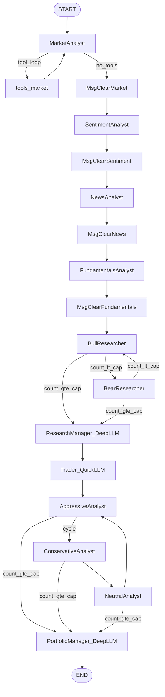
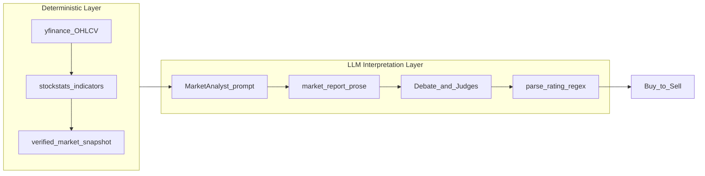
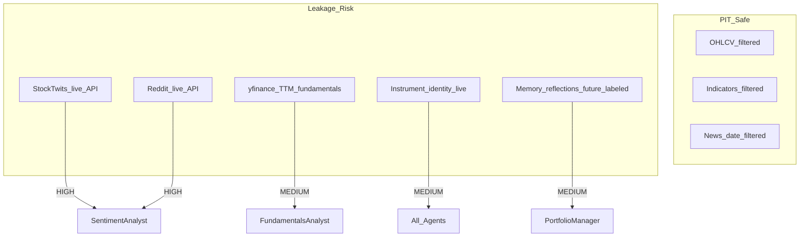
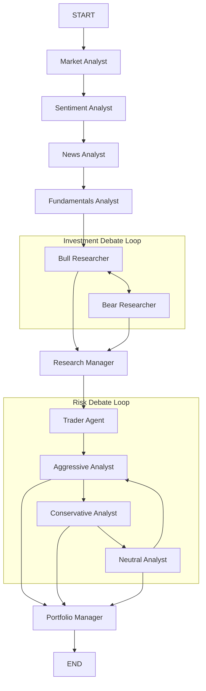
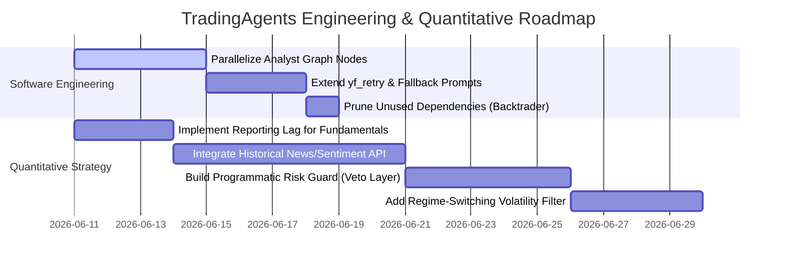

# TradingAgents v0.2.5 — Architecture & Quantitative Audit

**Audit date:** 2026-06-11  
**Repository:** TradingAgents (TauricResearch)  
**Version audited:** 0.2.5 (`pyproject.toml`)

---

## Executive Summary

TradingAgents is a **LangGraph-orchestrated multi-agent LLM research framework** that simulates the workflow of a trading desk: four specialist analysts produce reports, bull/bear researchers debate, a Research Manager synthesizes an investment plan, a Trader proposes a transaction, three risk debators critique it, and a Portfolio Manager renders a final 5-tier rating (`Buy` → `Sell`). The system is **not** a mechanical quant execution engine. Deterministic computation exists only in the data layer (OHLCV, stockstats indicators, verified snapshots); all trading signals, position sizing, stop-losses, and risk vetoes are LLM-generated prose.

**Core architectural finding:** The topology is a **hierarchical sequential pipeline with embedded debate loops** — not peer-to-peer, blackboard, or parallel fan-out. Consensus is achieved by **manager-as-judge after fixed-round debates**, not by voting, scoring, or weighted aggregation.

**Core quantitative finding:** Indicator math is sound (delegated to stockstats/Alpha Vantage), but **no coded signal rules** exist. Risk management cannot programmatically override the Trader. Historical backtests are **partially contaminated** by live sentiment feeds and TTM fundamentals. The reflection layer computes fixed-horizon long-only returns regardless of rating direction.

| Dimension | Score (1–5) | Rationale |
|-----------|:-----------:|-----------|
| **Architecture & Orchestration** | 3.5 | Clean LangGraph wiring, typed state, structured output for decision agents; dead concurrency config, CLI/propagate divergence |
| **Quantitative Validity** | 2.0 | Good OHLCV PIT guards; no mechanical signals, no risk engine, no real backtester |
| **Code Quality** | 3.5 | Strong dataflow resilience, provider capability table, 27 test modules; no async, global config mutation, missing E2E tests |
| **Production Readiness** | 2.5 | Checkpoint/memory only on `propagate()` path; no LLM rate-limit layer, no execution module despite README claims |

---

## 1. Architectural & Agent Orchestration Analysis

### 1.1 Topology Classification

The orchestration center is `TradingAgentsGraph` in `tradingagents/graph/trading_graph.py`, which compiles a `StateGraph(AgentState)` via `GraphSetup.setup_graph()` in `tradingagents/graph/setup.py`. The graph has exactly one entry point (`START`) and one exit (`END`); there are no parallel branches, fan-in joins, or external message brokers.



**Classification:** Hierarchical pipeline with two embedded **round-robin debate subgraphs**. This is closest to a staged workflow pattern (analyst → debate → judge → execute-proposal → risk-debate → final-judge), not a blackboard where agents post and subscribe to events.

Analyst wiring is explicitly sequential:

```91:109:tradingagents/graph/setup.py
        # Connect analysts in sequence
        for i, spec in enumerate(plan.specs):
            current_analyst = spec.agent_node
            current_tools = spec.tool_node
            current_clear = spec.clear_node
            ...
            if i < len(plan.specs) - 1:
                workflow.add_edge(current_clear, plan.specs[i + 1].agent_node)
            else:
                workflow.add_edge(current_clear, "Bull Researcher")
```

`analyst_concurrency_limit` is accepted by `GraphSetup.__init__` and stored in `AnalystExecutionPlan`, but **never used to parallelize**. Default is `1` in `default_config.py`; increasing it has no effect on graph topology. **[HIGH]** Misleading configuration surface.

### 1.2 Agent Roles & LLM Tiering

| README Role | Implementation | LLM Tier | Graph Node |
|-------------|----------------|----------|------------|
| Technical Analyst | Market Analyst | `quick_think_llm` | `"Market Analyst"` |
| Sentiment Expert | Sentiment Analyst (wire key `"social"`) | quick | `"Sentiment Analyst"` |
| News Analyst | News Analyst | quick | `"News Analyst"` |
| Fundamental Analyst | Fundamentals Analyst | quick | `"Fundamentals Analyst"` |
| Bull/Bear Researchers | `bull_researcher.py`, `bear_researcher.py` | quick | `"Bull Researcher"`, `"Bear Researcher"` |
| Research Manager | `research_manager.py` | **`deep_think_llm`** | `"Research Manager"` |
| Trader | `trader.py` | quick | `"Trader"` |
| Risk Management | Aggressive / Conservative / Neutral debators | quick | `"Aggressive Analyst"`, etc. |
| Portfolio Manager | `portfolio_manager.py` | **`deep_think_llm`** | `"Portfolio Manager"` |

Dual-tier LLM assignment is a deliberate cost/quality tradeoff: only the two judge nodes use the expensive model (`default_config.py` lines 56–57). All analysts, debators, and the Trader use the cheaper model.

There is **no single `RiskManager` class**. Risk is distributed across three adversarial debators plus the Portfolio Manager as final arbiter.

### 1.3 Communication Topologies

Three distinct channels carry information between agents:

#### Channel A: Typed State Bus (primary cross-phase handoff)

`AgentState` extends LangGraph's `MessagesState` with typed report fields and nested debate sub-states:

```46:75:tradingagents/agents/utils/agent_states.py
class AgentState(MessagesState):
    company_of_interest: ...
    market_report: ...
    sentiment_report: ...
    news_report: ...
    fundamentals_report: ...
    investment_debate_state: InvestDebateState
    investment_plan: ...
    trader_investment_plan: ...
    risk_debate_state: RiskDebateState
    final_trade_decision: ...
    past_context: ...
```

Downstream agents read analyst reports directly from these keys — not from `messages`. This is a **shared-memory bus** pattern: each agent writes to a named slot; later agents read the full slot contents.

#### Channel B: Messages (analyst tool loops only)

Market, News, and Fundamentals analysts bind LangChain tools and loop via conditional edges until the last message has no `tool_calls`:

```14:20:tradingagents/graph/conditional_logic.py
    def should_continue_market(self, state: AgentState):
        messages = state["messages"]
        last_message = messages[-1]
        if last_message.tool_calls:
            return "tools_market"
        return "Msg Clear Market"
```

Between analysts, `create_msg_delete()` strips all prior messages and injects an instrument-anchored placeholder. This prevents context-window bloat and avoids providers misinterpreting bare `"Continue"` prompts.

#### Channel C: Debate Sub-States (append-only histories)

Bull/Bear and risk debators append to `history` strings in `InvestDebateState` / `RiskDebateState`. Each turn increments `count`; routing logic uses `count` and `current_response`/`latest_speaker` prefix matching.

**Critique — token duplication:** Every debate round re-injects all four analyst reports verbatim. Bull researcher prompt structure:

```36:44:tradingagents/agents/researchers/bull_researcher.py
Resources available:
{instrument_context}
Market research report: {market_research_report}
Social media sentiment report: {sentiment_report}
Latest world affairs news: {news_report}
{fundamentals_label}: {fundamentals_report}
Conversation history of the debate: {history}
Last bear argument: {current_response}
```

With `max_debate_rounds=1` (default), this means 2 bull + 2 bear turns, each carrying the full report payload (~4× duplication of analyst output). Risk debators do the same — conservative debator injects all four reports plus trader plan on every turn (`conservative_debator.py` lines 16–34). **[MEDIUM]** Token inefficiency scales linearly with debate rounds.

There is **no summarization layer**, **no embedding retrieval**, and **no blackboard pub/sub** — agents cannot selectively subscribe to relevant report sections.

### 1.4 Consensus & Debate Resolution

There is **no voting, confidence scoring, or weighted consensus mechanism**.

#### Investment debate (Bull ↔ Bear)

Termination condition:

```52:61:tradingagents/graph/conditional_logic.py
    def should_continue_debate(self, state: AgentState) -> str:
        if state["investment_debate_state"]["count"] >= 2 * self.max_debate_rounds:
            return "Research Manager"
        if state["investment_debate_state"]["current_response"].startswith("Bull"):
            return "Bear Researcher"
        return "Bull Researcher"
```

With default `max_debate_rounds=1`, debate ends after 2 turns (one bull, one bear). Routing is **prefix-based on speaker label**, not content quality. The Research Manager then acts as sole judge, producing a structured `ResearchPlan` via Pydantic schema (`schemas.py`).

#### Risk debate (Aggressive → Conservative → Neutral cycle)

```63:73:tradingagents/graph/conditional_logic.py
    def should_continue_risk_analysis(self, state: AgentState) -> str:
        if state["risk_debate_state"]["count"] >= 3 * self.max_risk_discuss_rounds:
            return "Portfolio Manager"
        if state["risk_debate_state"]["latest_speaker"].startswith("Aggressive"):
            return "Conservative Analyst"
        ...
```

Default `max_risk_discuss_rounds=1` → 3 turns (one per risk persona), then Portfolio Manager judges.

#### Trader position in pipeline

The Trader sits **between** the two debates:

```
Analysts → Bull/Bear → Research Manager → Trader → Risk debators → Portfolio Manager
```

The Trader translates the 5-tier Research Manager recommendation into a 3-tier transaction proposal (`Buy` / `Hold` / `Sell`) with optional `entry_price`, `stop_loss`, and `position_sizing` fields (`TraderProposal` in `schemas.py`). Risk debators critique the trader proposal; PM synthesizes the final 5-tier rating.

**[CRITICAL] Risk override is narrative-only.** The Portfolio Manager prompt asks the LLM to "synthesize the risk analysts' debate" but imposes **no programmatic constraint** that PM must reject trades violating risk limits:

```42:64:tradingagents/agents/managers/portfolio_manager.py
        prompt = f"""As the Portfolio Manager, synthesize the risk analysts' debate and deliver the final trading decision.
...
- Research Manager's investment plan: **{research_plan}**
- Trader's transaction proposal: **{trader_plan}**
...
Be decisive and ground every conclusion in specific evidence from the analysts."""
```

There is no post-PM validation gate. An aggressive PM can ratify a trader proposal that conservative debators flagged, with no hard veto. The README claim that risk management "evaluates and adjusts trading strategies" (`README.md` line 95) is **aspirational**, not enforced in code.

### 1.5 Prompt Engineering Patterns

**No external prompt template files.** All prompts are inline f-strings or `ChatPromptTemplate` constructions inside agent factory functions (`market_analyst.py`, `bull_researcher.py`, `portfolio_manager.py`, etc.). This makes prompt versioning, A/B testing, and localization harder than a dedicated prompt registry would allow.

#### Cross-cutting prompt utilities

| Utility | Location | Purpose |
|---------|----------|---------|
| `get_language_instruction()` | `agent_utils.py` | Appends output language directive; returns `""` for English (zero token cost) |
| `get_instrument_context_from_state()` | `agent_utils.py` | Injects deterministic ticker identity on every agent turn |
| `bind_structured()` / `invoke_structured_or_freetext()` | `structured.py` | Pydantic schema enforcement with free-text fallback |
| Schema field descriptions | `schemas.py` | Double as model output instructions for decision agents |

#### Structured output layer

Decision agents (Research Manager, Trader, Portfolio Manager, Sentiment Analyst) use `llm.with_structured_output(schema)` with graceful degradation:

```48:73:tradingagents/agents/utils/structured.py
def invoke_structured_or_freetext(...):
    if structured_llm is not None:
        try:
            result = structured_llm.invoke(prompt)
            return render(result)
        except Exception as exc:
            logger.warning(
                "%s: structured-output invocation failed (%s); retrying once as free text",
                agent_name, exc,
            )
    response = plain_llm.invoke(prompt)
    return response.content
```

**[MEDIUM]** The `except Exception` catch is broad — validation errors, malformed JSON, and transient provider failures all trigger the same single free-text fallback. Downstream `parse_rating()` may then fail to extract a valid rating from unstructured prose.

Provider-specific structured-output dispatch is handled in `llm_clients/capabilities.py` and `openai_client.py` (`with_structured_output` override for models lacking `tool_choice` support).

#### Context window utilization

| Strategy | Mechanism | Effect |
|----------|-----------|--------|
| Message clearing | `create_msg_delete()` between analysts | Prevents tool-loop history accumulation |
| Report field isolation | Analyst output stored in `market_report`, etc. | Messages channel not used cross-phase |
| Sentiment pre-fetch | Data injected at turn 0, no tool loop | Saves 1–3 tool rounds vs other analysts |
| Bounded memory | `get_past_context(ticker, n_same=5, n_cross=3)` | Caps historical injection |
| Recursion limit | `max_recur_limit=100` default | Only guard against runaway tool loops |
| Long inline prompts | Market analyst carries full indicator catalog (~30 lines) | ~500+ tokens per market analyst invocation |

**Not implemented:** prompt caching (OpenAI/Anthropic), context compression/summarization, dynamic truncation, or token budget allocation across agents.

### 1.6 State Persistence

Three persistence layers exist:

#### Layer 1: Per-run JSON state logs

After `graph.invoke()`, `_log_state()` writes to `{results_dir}/{ticker}/TradingAgentsStrategy_logs/full_states_log_{date}.json` containing all reports, debate histories, plans, and final decision (`trading_graph.py` lines 414–454).

#### Layer 2: Markdown memory log with deferred reflection

`TradingMemoryLog` (`agents/utils/memory.py`) maintains an append-only log at `~/.tradingagents/memory/trading_memory.md`:

- **Phase A (end of run):** `store_decision()` appends a pending entry with rating tag parsed by `parse_rating()`.
- **Phase B (start of next same-ticker run):** `_resolve_pending_entries()` fetches 5-day returns, calls `Reflector.reflect_on_final_decision()`, writes reflection back.

`get_past_context()` injects resolved entries into `past_context` at run start — consumed primarily by Portfolio Manager.

#### Layer 3: LangGraph SQLite checkpoints (optional)

When `checkpoint_enabled=True`, per-ticker SQLite DB at `{data_cache_dir}/checkpoints/{TICKER}.db`. Thread ID = SHA256 of `{ticker}:{date}`. Cleared on successful completion.

#### **[CRITICAL] CLI vs programmatic path divergence**

The CLI (`cli/main.py`) builds state and streams the graph directly, **bypassing `propagate()`**:

```1116:1135:cli/main.py
        init_agent_state = graph.propagator.create_initial_state(
            selections["ticker"],
            selections["analysis_date"],
            asset_type=selections["asset_type"],
            instrument_context=instrument_context,
        )
        ...
        for chunk in graph.graph.stream(init_agent_state, **args):
```

Consequences of this bypass:

| Feature | `propagate()` path | CLI path |
|---------|-------------------|----------|
| `past_context` injection | Yes (`memory_log.get_past_context`) | **No** — `past_context` defaults to `""` |
| `memory_log.store_decision()` | Yes | **No** |
| `_resolve_pending_entries()` | Yes (pre-run) | **No** |
| Checkpoint recompile | Yes (`get_checkpointer`) | **No** — `checkpoint_enabled` set but graph never recompiled |
| JSON state log (`_log_state`) | Yes | **No** — CLI writes markdown reports separately |

`checkpoint_enabled` is assigned at CLI line 1008 but never triggers `get_checkpointer()` or graph recompilation. **[CRITICAL]** Primary user entry point (`tradingagents` CLI) does not exercise half the persistence/reflection infrastructure.

---

## 2. Quantitative Trading Strategy Audit

### 2.1 Signal Generation Architecture

TradingAgents separates **data computation** (deterministic) from **signal interpretation** (LLM-only). There is no intermediate rule engine.



#### Deterministic indicator computation

Indicators are computed via stockstats `wrap()` on OHLCV filtered to `curr_date`:

```65:125:tradingagents/dataflows/stockstats_utils.py
def load_ohlcv(symbol: str, curr_date: str) -> pd.DataFrame:
    """Fetch OHLCV data with caching, filtered to prevent look-ahead bias."""
    ...
    # Filter to curr_date to prevent look-ahead bias in backtesting
    data = data[data["Date"] <= curr_date_dt]
```

Supported indicators (yfinance path): `close_50_sma`, `close_200_sma`, `close_10_ema`, `macd`, `macds`, `macdh`, `rsi`, `boll`, `boll_ub`, `boll_lb`, `atr`, `vwma`, `mfi`.

Bulk calculation in `_get_stock_stats_bulk()` computes indicators across the full filtered history at once, then maps date → value. This is mathematically correct for rolling indicators as long as the input series is PIT-filtered (which it is).

`build_verified_market_snapshot()` (`market_data_validator.py`) provides a deterministic ground-truth table the market analyst is instructed to treat as authoritative for exact numeric claims — a strong anti-hallucination measure introduced for issue #830.

#### Signal layer: prompt folklore only

The market analyst system prompt describes trading heuristics in natural language:

```37:38:tradingagents/agents/analysts/market_analyst.py
Momentum Indicators:
- rsi: RSI: Measures momentum to flag overbought/oversold conditions. Usage: Apply 70/30 thresholds and watch for divergence to signal reversals.
```

There is **no code** that:
- Detects RSI crossing 30/70
- Identifies MACD signal-line crossovers
- Computes golden/death cross events
- Generates a structured `{signal: BUY, strength: 0.7, indicator: "rsi"}` object

The **only deterministic downstream signal** is `parse_rating()` — a regex heuristic on Portfolio Manager prose:

```30:50:tradingagents/agents/utils/rating.py
def parse_rating(text: str, default: str = "Hold") -> str:
    for line in text.splitlines():
        m = _RATING_LABEL_RE.search(line)
        if m and m.group(1).lower() in _RATING_SET:
            return m.group(1).capitalize()
    ...
    return default
```

**Assessment:** Indicator math is sound (standard stockstats definitions). Trading rules exist only as LLM prompt guidance with **no backtested mechanical edge**, no information coefficient measurement, and no signal attribution.

### 2.2 Risk Management Constraints

| Capability | Status | Implementation |
|------------|--------|----------------|
| Stop-loss | Optional LLM field | `TraderProposal.stop_loss: Optional[float]` |
| Position sizing | Optional prose | `TraderProposal.position_sizing: Optional[str]` e.g. `'5% of portfolio'` |
| Entry price | Optional LLM field | `TraderProposal.entry_price: Optional[float]` |
| VaR / CVaR | **Absent** | — |
| Max drawdown limits | **Absent** | — |
| Portfolio heat / correlation | **Absent** | — |
| Kelly criterion | **Absent** | — |
| Volatility targeting | **Absent** | — |
| ATR-based stops | Prompt guidance only | Market analyst describes ATR usage; no `stop = entry - N×ATR` computation |
| Order execution | **Absent** | README line 96 claims "simulated exchange" — no execution module exists |

Risk debators produce conversational arguments. The conservative debator's objective is stated in prompt prose ("protect assets, minimize volatility") but there is no validation that its recommendations influence the PM output.

**Can risk realistically override the Trader?** Only if the Portfolio Manager LLM chooses to side with conservative arguments. There is no:
- Hard veto function
- Risk budget check against account equity
- Comparison of `stop_loss` distance vs ATR
- Parsing/validation of `position_sizing` strings against config limits

**[CRITICAL]** For production trading, this architecture cannot enforce risk constraints. It can only *suggest* them in natural language.

### 2.3 Look-Ahead Bias, Data Leakage & Hallucination

#### Protections implemented

| Guard | Location | Mechanism |
|-------|----------|-----------|
| OHLCV PIT filter | `stockstats_utils.py:122-123` | `data[data["Date"] <= curr_date_dt]` |
| Financial statement PIT | `filter_financials_by_date()` | Drop fiscal periods after `curr_date` |
| Alpha Vantage indicators | `alpha_vantage_indicator.py` | Date window `before <= date <= curr_date` |
| Ticker news date filter | `yfinance_news.py` | Filter by `pub_date` within `[start_date, end_date]` |
| Global news cutoff | `yfinance_news.py` | Skip articles published after `curr_date` |
| No-data sentinel | `interface.py` | `NO_DATA_AVAILABLE` prevents fabrication |
| Verified snapshot | `market_data_validator.py` | Deterministic OHLCV + indicator table |
| Instrument identity | `agent_utils.py` | `resolve_instrument_identity()` anchors ticker to real entity |
| Sentiment redesign | `sentiment_analyst.py` | Pre-fetch replaces tool-calling that caused Reddit fabrication (#557, #796) |

Market analyst prompt explicitly forbids inventing bounces or percentage moves without tool support (lines 51–52).

#### Remaining leakage risks



| Risk | Severity | Detail |
|------|----------|--------|
| StockTwits live fetch | **[HIGH]** | `fetch_stocktwits_messages(ticker, limit=30)` — no `trade_date` parameter (`sentiment_analyst.py:70`) |
| Reddit live fetch | **[HIGH]** | `fetch_reddit_posts(ticker)` — no historical filter (`sentiment_analyst.py:71`) |
| yfinance fundamentals TTM | **[MEDIUM]** | `get_fundamentals` annotated `curr_date (not used for yfinance)` (`y_finance.py:260`) |
| Instrument identity | **[MEDIUM]** | `yf.Ticker(ticker).info` is live snapshot, not PIT |
| OHLCV cache file | **[LOW]** | Cache downloads through today, filtered at read time — safe for analysis, impure cache artifact |
| Memory reflections | **[MEDIUM]** | Outcome-labeled reflections injected into PM contain future knowledge relative to original `trade_date` if re-running historical dates |
| LLM non-determinism | **Inherent** | Temperature, reasoning models, debate sampling — documented in README |

Running `propagate("NVDA", "2024-05-10")` today will inject **current** StockTwits/Reddit sentiment into a May 2024 analysis. This invalidates historical event studies for any strategy relying on sentiment input.

### 2.4 Backtesting & Outcome Evaluation

**No vectorized backtester exists.** Dependencies `backtrader>=1.9.78.123` and `redis>=6.2.0` are declared in `pyproject.toml` but have **zero imports** in the codebase.

What exists:

1. **Single-date analysis:** `TradingAgentsGraph.propagate(ticker, trade_date)` 
2. **Deferred outcome labeling:** `_fetch_returns()` computes fixed-horizon returns
3. **LLM reflection:** `Reflector.reflect_on_final_decision()` generates lessons from known outcomes

#### Mathematical critique of `_fetch_returns`

```246:256:tradingagents/graph/trading_graph.py
            actual_days = min(holding_days, len(stock) - 1, len(bench) - 1)
            raw = float(
                (stock["Close"].iloc[actual_days] - stock["Close"].iloc[0])
                / stock["Close"].iloc[0]
            )
            bench_ret = float(
                (bench["Close"].iloc[actual_days] - bench["Close"].iloc[0])
                / bench["Close"].iloc[0]
            )
            alpha = raw - bench_ret
```

Properties of this formula:

- **Always long:** Computes buy-and-hold return regardless of `Buy`/`Sell`/`Hold` rating
- **Fixed horizon:** `holding_days=5` default; not tied to PM `time_horizon` field
- **No transaction costs:** Zero slippage, zero commission
- **No shorting:** Sell ratings are not mapped to short positions
- **No position sizing:** Ignores `TraderProposal.position_sizing`
- **Alpha = raw - benchmark:** Simple difference, not beta-adjusted (no CAPM residual)

This is **decision journaling with ex-post P&L labeling**, not strategy backtesting. You cannot compute Sharpe ratio, max drawdown, information coefficient, or hit rate from this infrastructure without building an external harness.

### 2.5 Execution Latency Vulnerability

The framework has **no execution layer** — no order routing, no latency model, no fill simulation. The README's "simulated exchange" (line 96) is conceptual only.

For live deployment, the sequential pipeline implies:
- Wall time ≈ Σ(analyst tool loops) + Σ(debate rounds) + 3 decision LLM calls
- Typical run: 4 analysts × (1–5 tool rounds each) + 2 debate turns + 1 RM + 1 Trader + 3 risk turns + 1 PM ≈ **15–30+ LLM invocations**
- No streaming partial decisions; no early-exit on high-confidence signals
- Data fetches (yfinance, StockTwits, Reddit) are synchronous and sequential within each analyst

**[MEDIUM]** For intraday or event-driven strategies, this latency profile is incompatible with time-sensitive execution. The framework is designed for end-of-day research decisions.

---

## 3. Code Quality, Concurrency & Performance Review

### 3.1 Asynchronous Execution

**Finding: Fully synchronous.** No `async`/`asyncio` usage in application code. All LLM calls use blocking `.invoke()`; graph execution uses `.invoke()` or `.stream()`. Data fetches in `stockstats_utils.py`, `reddit.py`, `stocktwits.py` are blocking HTTP.

Implications:
- Analyst wall time is strictly additive (4 analysts sequential by default)
- No concurrent data pre-fetching across analysts
- `analyst_concurrency_limit` config is dead code in graph wiring

The only threading is defensive: `StatsCallbackHandler` in `cli/stats_handler.py` uses `threading.Lock()` for callback counter updates.

### 3.2 Error Handling & Retry Logic

| Layer | Behavior | Assessment |
|-------|----------|------------|
| yfinance | `yf_retry()` — exponential backoff on `YFRateLimitError`, 3 retries | **[GOOD]** |
| Alpha Vantage | Vendor fallback on `AlphaVantageRateLimitError` | **[GOOD]** |
| Reddit | Inter-request delay, JSON→RSS fallback | **[GOOD]** |
| LLM APIs | Passthrough `max_retries`/`timeout` to LangChain — **not set in DEFAULT_CONFIG** | **[MEDIUM]** |
| Structured output | Single free-text fallback on any `Exception` | **[MEDIUM]** |
| Graph invoke | No `try/except` wrapper — mid-run failure propagates uncaught | **[HIGH]** |
| Instrument identity | Fail-open: `except Exception` → return `{}` | **[LOW]** acceptable |
| `_fetch_returns` | Broad `except Exception` → log warning, return `None` | **[LOW]** deferred retry |

**[HIGH]** No application-level handling for HTTP 429 from LLM providers. A rate-limited OpenAI/Anthropic call during a debate round kills the entire run. Checkpoint resume (on `propagate()` path only) is the only recovery mechanism.

Tool loops are bounded only by `recursion_limit=100` (`default_config.py:82`). A misbehaving analyst that repeatedly calls tools will fail late with a LangGraph recursion error, not a graceful per-node timeout.

### 3.3 Race Conditions & Concurrency Safety

| Area | Risk | Severity |
|------|------|----------|
| Memory log writes | Append via `open(..., "a")`; `batch_update_with_outcomes` uses tmp+replace but **no file locking** | **[MEDIUM]** |
| Global `_config` | Module-level mutable dict in `dataflows/config.py`; `set_config()` called in `TradingAgentsGraph.__init__` | **[MEDIUM]** |
| Checkpoint DB | Per-ticker SQLite reduces cross-ticker contention; same ticker+date concurrent runs could conflict | **[LOW]** |
| Results JSON | Per-date file per ticker — safe unless duplicate concurrent runs | **[LOW]** |

`get_config()` returns `deepcopy(_config)` — readers are safe, but `set_config()` during concurrent graph runs in the same process would race.

### 3.4 Token Cost Efficiency

**Optimizations present:**
- Dual LLM tiers (cheap for 10+ nodes, expensive for 2 judges)
- Message clearing between analysts
- Sentiment pre-fetch (single LLM call vs multi-round tools)
- Regex `parse_rating()` instead of second LLM for signal extraction
- Bounded memory injection (5 same + 3 cross ticker)
- `get_language_instruction()` returns `""` for English
- Configurable `news_article_limit` / `global_news_article_limit`

**Inefficiencies:**
- Full analyst reports re-injected every debate round (see §1.3)
- Market analyst system prompt carries ~30-line inline indicator catalog on every invocation
- No prompt caching (OpenAI/Anthropic cache APIs)
- Reflection runs sequential LLM calls in `_resolve_pending_entries()` before each `propagate()`
- Debug mode streams and pretty-prints every chunk (CLI always runs `debug=True`)

Estimated token budget per full run (4 analysts, depth=1): **50,000–150,000 tokens** depending on tool loop depth and report verbosity. Debate rounds are the primary multiplier.

### 3.5 Dependency Management

**Manifest:** `pyproject.toml` (Python ≥3.10, managed via `uv.lock`).

| Package | Role | Notes |
|---------|------|-------|
| `langgraph`, `langgraph-checkpoint-sqlite` | Workflow + resume | Core |
| `langchain-*` | LLM abstraction | 4 provider packages |
| `pandas`, `yfinance`, `stockstats` | Market data | Core |
| `pydantic` | Structured output schemas | Transitive + direct |
| `typer`, `rich`, `questionary` | CLI | |
| `redis>=6.2.0` | **Unused** | Zero imports in codebase |
| `backtrader>=1.9.78.123` | **Unused** | Zero imports in codebase |

**[LOW]** Dead dependencies add install weight and imply unfinished features.

### 3.6 Test Coverage

~27 test modules under `tests/`. Markers: `unit`, `integration`, `smoke`.

**Well-covered:**
- Memory log (`test_memory_log.py` — ~68 tests)
- Structured agents (`test_structured_agents.py`)
- LLM capabilities (`test_capabilities.py`, provider-specific tests)
- Dataflows (`test_no_data_handling.py`, `test_market_data_validator.py`, `test_symbol_utils.py`)
- Signal processing (`test_signal_processing.py`)
- Checkpoint utilities (`test_checkpoint_resume.py` — toy graph, not full TradingAgents graph)

**Gaps (severity-rated):**

| Gap | Severity |
|-----|----------|
| No E2E test of `TradingAgentsGraph` with mocked LLM | **[HIGH]** |
| CLI/propagate parity untested | **[HIGH]** |
| `GraphSetup` / `ConditionalLogic` routing untested | **[MEDIUM]** |
| Individual analyst tool-loop agents untested | **[MEDIUM]** |
| Risk debator agents untested | **[MEDIUM]** |
| `analyst_concurrency_limit > 1` behavior untested (would document dead config) | **[LOW]** |
| No coverage tooling configured in pyproject | **[LOW]** |

### 3.7 Extensibility

**Well-designed patterns:**
- LLM provider factory (`llm_clients/factory.py`) with lazy imports
- Capability table (`capabilities.py`) for model-specific quirks
- Data vendor routing (`dataflows/interface.py`) with category + tool-level overrides
- Analyst execution registry (`analyst_execution.py` — `ANALYST_NODE_SPECS`)
- Env-var config overrides (`default_config.py` — `_ENV_OVERRIDES`)

**Friction:** Adding a new analyst type requires coordinated edits in ≥6 files:
1. `analyst_execution.py` — register in `ANALYST_NODE_SPECS`
2. `graph/setup.py` — factory dict + edges
3. `conditional_logic.py` — `should_continue_{key}()`
4. `trading_graph.py` — `_create_tool_nodes()`
5. `cli/models.py` — `AnalystType` enum
6. `cli/main.py` — `ANALYST_MAPPING`

No plugin registry or discovery mechanism exists.

---

## 4. Actionable Improvement Roadmap

### Tier 1 — High Impact, Moderate Effort (1–3 weeks each)

#### 1.1 Wire analyst parallelism via LangGraph `Send`

**Problem:** `analyst_concurrency_limit` is stored but unused; 4 analysts run sequentially.  
**Solution:** After `START`, fan out with `Send` API to run independent analysts concurrently; join before Bull Researcher. Honor `analyst_concurrency_limit` as a semaphore.  
**Impact:** 2–4× wall-time reduction for analyst phase.  
**Files:** `setup.py`, `analyst_execution.py`, new join node.

#### 1.2 Unify CLI and `propagate()` paths

**Problem:** CLI bypasses memory log, `past_context`, checkpoints, and JSON state logging.  
**Solution:** Route `cli/main.py` through `graph.propagate()` with a streaming callback adapter for the Rich TUI.  
**Impact:** Feature parity; reflection loop works from CLI.  
**Files:** `cli/main.py`, `trading_graph.py` (add streaming hook).

#### 1.3 Point-in-time sentiment guard

**Problem:** StockTwits/Reddit fetch live data regardless of `trade_date`.  
**Solution:** (a) Add `trade_date` parameter to fetchers; reject/disable social sources when `trade_date < today - 1 day`. (b) Long-term: integrate historical sentiment archive (e.g., StockTwits API with date filter, Pushshift for Reddit).  
**Impact:** Enables valid historical backtests for sentiment-inclusive runs.  
**Files:** `sentiment_analyst.py`, `stocktwits.py`, `reddit.py`.

#### 1.4 Programmatic risk veto layer

**Problem:** PM can ratify any trader proposal regardless of risk debate.  
**Solution:** Post-PM validation function:
```python
def validate_risk_constraints(trader_proposal, market_snapshot, config) -> list[str]:
    violations = []
    if trader_proposal.stop_loss and trader_proposal.entry_price:
        atr = market_snapshot["atr"]
        if abs(entry - stop) > config["max_stop_atr_multiple"] * atr:
            violations.append(f"Stop distance {dist:.2f} exceeds {max_mult}×ATR")
    # Parse position_sizing against config["max_position_pct"]
    return violations
```
If violations exist, re-invoke PM with constraint context or force `Hold`.  
**Impact:** First mechanical risk enforcement in the pipeline.  
**Files:** New `risk_validator.py`, `portfolio_manager.py`, `default_config.py`.

#### 1.5 Mechanical signal reconciliation layer

**Problem:** RSI 70/30, MACD crosses exist only in prompts.  
**Solution:** Add `compute_mechanical_signals(ohlcv_df) -> SignalBundle` that detects crossovers, threshold breaches, and trend regime. Inject as structured JSON into market analyst context; prompt requires explicit reconciliation ("mechanical signals say X, my assessment is Y because...").  
**Impact:** Auditable signal provenance; foundation for backtesting.  
**Files:** New `signals/mechanical.py`, `market_analyst.py`.

### Tier 2 — Quantitative Strategy Enhancements (2–6 weeks each)

#### 2.1 Regime detection module

Feed Research Manager a structured `RegimeState` object:
- VIX level and term structure (contango/backwardation)
- Yield curve slope (10Y–2Y spread)
- Simple HMM or volatility-regime classifier on trailing returns

Enables regime-conditioned position sizing recommendations.

#### 2.2 Confidence-weighted consensus scoring

Replace fixed-round debates with structured analyst outputs:
```python
class AnalystSignal(BaseModel):
    direction: Literal["bullish", "bearish", "neutral"]
    confidence: float  # 0.0–1.0
    key_evidence: list[str]
```
Research Manager receives `list[AnalystSignal]` and computes weighted score before generating `ResearchPlan`. Debate rounds become optional depth, not the sole consensus mechanism.

#### 2.3 Event-study backtest harness

```python
for date in trading_days(start, end):
    state, rating = graph.propagate(ticker, date)
    position = rating_to_position(rating)  # Buy=+1, Sell=-1, Hold=0
    returns.append(position * forward_return(ticker, date, horizon))
```
Compute: IC (rating vs forward return), Sharpe, max DD, hit rate, turnover. Add transaction cost model (configurable bps).

#### 2.4 Point-in-time fundamentals

Integrate SEC EDGAR XBRL or a PIT vendor (Compustat, FactSet). Filter `get_fundamentals` output by `trade_date`. Until then, document fundamentals as "latest TTM snapshot" and exclude from historical backtests.

### Tier 3 — Engineering Hardening (1–2 weeks each)

| # | Recommendation | Effort | Impact |
|---|---------------|--------|--------|
| 3.1 | Application-level LLM retry with exponential backoff on 429/5xx | 1 week | **[HIGH]** run resilience |
| 3.2 | Async data pre-fetch (`asyncio.gather` for OHLCV, news, fundamentals before analyst phase) | 1 week | **[MEDIUM]** latency |
| 3.3 | Analyst plugin registry (single `register_analyst()` instead of 6-file edits) | 2 weeks | **[MEDIUM]** extensibility |
| 3.4 | Remove or implement `redis`/`backtrader` deps | 1 day | **[LOW]** hygiene |
| 3.5 | Memory log file locking (`portalocker` or `fcntl.flock`) | 2 days | **[MEDIUM]** concurrency safety |
| 3.6 | E2E integration test: mock LLM + real dataflows through full graph | 1 week | **[HIGH]** regression safety |
| 3.7 | Per-node timeout + graceful degradation (skip analyst on timeout, mark report as unavailable) | 1 week | **[MEDIUM]** resilience |
| 3.8 | Prompt template externalization (Jinja2/YAML in `prompts/` directory) | 1 week | **[LOW]** maintainability |

---

## 5. Summary Scorecard

| Dimension | Score | Key Strength | Key Weakness |
|-----------|:-----:|-------------|-------------|
| Architecture & Orchestration | **3.5 / 5** | Clean LangGraph pipeline, typed state, dual LLM tiers | Dead concurrency config, CLI/propagate split, no consensus scoring |
| Quantitative Validity | **2.0 / 5** | PIT OHLCV guards, verified snapshot, anti-fabrication sentinels | No mechanical signals, no risk engine, sentiment leakage, no real backtester |
| Code Quality | **3.5 / 5** | Provider capability table, data vendor fallback, 27 test modules | Fully synchronous, global config mutation, broad exception catches |
| Production Readiness | **2.5 / 5** | Checkpoint resume, memory log, structured output | CLI missing half the infrastructure, no LLM rate limits, no execution layer |

**Bottom line:** TradingAgents is a well-engineered **multi-agent qualitative research scaffold** with thoughtful data-layer hardening (verified snapshots, PIT OHLCV, vendor fallback). It is **not** a production quantitative trading system. The gap between README marketing ("simulated exchange," "risk management team evaluates and adjusts") and code reality (no execution, no risk veto, no mechanical signals) is the primary risk for users treating outputs as tradeable alpha.

To evolve toward production-grade quant infrastructure, prioritize: (1) CLI/propagate unification, (2) PIT sentiment guard, (3) mechanical signal layer, (4) programmatic risk veto, and (5) event-study backtest harness. These five changes transform the framework from an LLM research demo into a testable, auditable decision system.

---

*Report generated by architecture audit of TradingAgents v0.2.5. All file paths relative to repository root.*
# TradingAgents — Production-Grade Architecture Audit & Quantitative Review

**Auditor**: DeepSeek V4 (analysis date: 2026-06-11)
**Repository**: `TauricResearch/TradingAgents` v0.2.5
**Scope**: 92 source files across 12 packages, 30 test files, 1,500+ lines of non-test orchestration logic

---

## Table of Contents

1. [Architectural & Agent Orchestration Analysis](#1-architectural--agent-orchestration-analysis)
2. [Quantitative Trading Strategy Audit](#2-quantitative-trading-strategy-audit)
3. [Code Quality, Concurrency & Performance Review](#3-code-quality-concurrency--performance-review)
4. [Critical Findings & Risk Surface](#4-critical-findings--risk-surface)
5. [Actionable Improvement Roadmap](#5-actionable-improvement-roadmap)

---

## 1. Architectural & Agent Orchestration Analysis

### 1.1 Orchestration Topology

The system uses **LangGraph's `StateGraph`** to define a directed acyclic workflow with two internal debate loops. The topology is a **sequential pipeline with embedded ping-pong loops**:

```
START
  │
  ▼
[Analyst 1] ──(tool loop)──→ [Msg Clear 1] ──→ [Analyst 2] ──→ ... ──→ [Analyst N]
                                                                          │
                                                                          ▼
                                                              [Msg Clear N]
                                                                          │
                                                          ┌───────────────┘
                                                          ▼
                                              [Bull Researcher] ←──→ [Bear Researcher]
                                                      │  (debate loop, max_debate_rounds)
                                                      ▼
                                              [Research Manager] ──→ [Trader]
                                                                        │
                                                                        ▼
                                                            [Aggressive Analyst]
                                                                    │
                                                                    ▼
                                                            [Conservative Analyst]
                                                                    │
                                                                    ▼
                                                            [Neutral Analyst]
                                                                    │
                                                          (risk debate loop,
                                                    max_risk_discuss_rounds)
                                                                    │
                                                                    ▼
                                                        [Portfolio Manager]
                                                                    │
                                                                    ▼
                                                                   END
```

**Key observations**:

- **Pipe-and-filter for analysts**: Four analyst types (Market, Sentiment, News, Fundamentals) execute sequentially. Each analyst follows a tool-call loop pattern: LLM → tool calls → LLM → (repeat until final report). After completion, messages are cleared via `RemoveMessage` to preserve context window budget.

- **Ping-pong debate for researchers**: Bull and Bear researchers alternate arguments by reading `investment_debate_state.current_response` to know what the opponent just said. The `ConditionalLogic.should_continue_debate` method routes based on `current_response.startswith("Bull")` — a brittle string prefix check that would break if an analyst's prose does not begin with the expected label.

- **Round-robin for risk debators**: Three risk analysts (Aggressive → Conservative → Neutral → Aggressive → ...) rotate. `should_continue_risk_analysis` checks `latest_speaker.startswith("Aggressive")` — similarly fragile.

- **Judge synthesis nodes**: The Research Manager and Portfolio Manager act as judges. Both receive the full debate transcript (`history`) and produce a structured decision via `with_structured_output`.

### 1.2 State Machine Design

**State**: `AgentState` (extends LangGraph's `MessagesState`) carries 13 fields including four analyst report strings, two debate state machines, the trader's plan, and the final decision. All agent communication happens through shared state — this is a **blackboard architecture** within a single process.

**Debate state machines**:
- `InvestDebateState`: bull_history, bear_history, history, current_response, judge_decision, count
- `RiskDebateState`: aggressive/conservative/neutral histories, latest_speaker, three current_response fields, judge_decision, count

**Critical weakness**: The debate states are **flat string accumulators**. `history` is a concatenated string of every message prefixed with `"Bull Analyst: "` or `"Bear Analyst: "`. There is no structured parsing, no token-budget management, and no semantic chunking. A 10-round debate could inject 20+ full analyst reports worth of text into the context of every subsequent call.

### 1.3 Agent Communication Patterns

| Agent Pair | Pattern | Medium | Resolver |
|---|---|---|---|
| Analyst → Researcher | Sequential handoff | Shared state (`analyst_report` fields) | Graph edges |
| Bull ↔ Bear | Alternating debate | `current_response` + `history` strings | `should_continue_debate` |
| Aggressive ↔ Conservative ↔ Neutral | Round-robin | `current_*_response` fields | `should_continue_risk_analysis` |
| Research Manager → Trader → Risk | Sequential | `investment_plan`, `trader_investment_plan` | Graph edges |
| Risk → Portfolio Manager | Sequential | `risk_debate_state.history` | Graph edges |

**No peer-to-peer discussion exists**. All debates are mediated through shared mutable state with routing controlled by `ConditionalLogic`. The system does not use LangGraph's `Send` API for fan-out or parallel execution — everything is single-threaded sequential (even the `analyst_concurrency_limit` parameter, which defaults to `1` and is never used for actual concurrent execution in the current code).

### 1.4 Consensus & Debate-Resolution Protocol

**Debate termination**:
- Investment debate: `count >= 2 * max_debate_rounds` (default: 2 rounds = 4 total messages, 2 bull + 2 bear)
- Risk debate: `count >= 3 * max_risk_discuss_rounds` (default: 3 rounds = 9 total messages)

**Resolution**:
- The Research Manager reads the full debate history and produces a structured `ResearchPlan` with a `recommendation` from the 5-tier scale.
- The Portfolio Manager reads the risk debate history, the Research Plan, the Trader Proposal, and the `past_context` (memory log), then produces a `PortfolioDecision`.

The judges are **not bound by any formal voting or aggregation mechanism**. There is no weighted scoring of bull vs. bear arguments, no quantitative sentiment threshold, and no override mechanism if the LLM misreads the debate. The quality of resolution depends entirely on the LLM's ability to summarize from a long, concatenated debate string.

### 1.5 Prompt Engineering Patterns

**System prompt structure** (dominant pattern in analysts):
```
"system" message containing:
  - Role definition
  - Tool descriptions and usage guidance
  - Indicator descriptions (for market analyst: 8 categories, ~40 lines)
  - Output format requirements
  - Language instruction
  
"human" messages from state["messages"]
```

**Pattern-specific prompt injection**:
- `instrument_context`: resolved once at run start via yfinance, injected into every agent. Prevents hallucinating the wrong company (#814).
- `past_context`: memory log entries injected into the Portfolio Manager's prompt. Capped at 5 same-ticker + 3 cross-ticker entries.
- `current_date`: injected into every prompt for temporal anchoring.

**Token inefficiency**: The system message for the Market Analyst alone is ~50 lines of indicator descriptions repeated verbatim on every call. The News and Fundamentals analysts have similar verbosity. With 4 analysts + 2 researchers + 1 research manager + 1 trader + 3 risk analysts + 1 PM = 12 LLM calls minimum, even at 500 tokens per system message, prompt overhead is ~6,000 tokens per run before any data or analysis is included.

### 1.6 State Persistence

- **Checkpointing**: Per-ticker SQLite databases using `langgraph-checkpoint-sqlite`. Thread IDs are deterministic SHA-256 hashes of `{ticker}:{date}`. The `SqliteSaver` context manager uses `check_same_thread=False`, which is safe in single-process sequential execution but could race in async or multi-threaded deployments.

- **Memory log**: Append-only markdown file with `<!-- ENTRY_END -->` delimiters. Each entry is a pipe-delimited tag line (`[date | ticker | rating | outcome]`) followed by `DECISION:` and `REFLECTION:` sections. Write path uses temp-file + `os.replace()` for atomicity. Idempotency is ensured by a raw-text scan for duplicate tag lines — O(n) per write but acceptable for single-ticker runs.

- **Price data cache**: CSV files per symbol with a fixed 5-year window. Cache is written once and never invalidated. A `NoMarketDataError` on empty cache triggers re-fetch. No TTL-based or size-based eviction — could grow unbounded for large universes.

---

## 2. Quantitative Trading Strategy Audit

### 2.1 Technical Indicator Suite

The Market Analyst selects up to 8 indicators from:

| Category | Indicators | Assessment |
|---|---|---|
| Moving Averages | 50 SMA, 200 SMA, 10 EMA | Reasonable trend-following set. Missing 20 EMA (common for shorter-term crossovers with 50/200) |
| MACD | MACD, Signal, Histogram | Complete. No issues. |
| Momentum | RSI (only) | **Single momentum indicator is risky**. Missing Stochastic, Williams %R, or any momentum oscillator with different mathematical properties |
| Volatility | Bollinger Bands (middle, upper, lower), ATR | Complete coverage. |
| Volume | VWMA (only) | **Incomplete**. No OBV, Volume Profile, or Chaikin Money Flow. VWMA alone does not capture accumulation/distribution dynamics. |
| Money Flow | MFI | Included in indicator dictionary but NOT documented in the Market Analyst prompt — LLM may never invoke it. |

**Critical mathematical concern**: The prompt explicitly instructs analysts to avoid redundancy ("do not select both rsi and stochrsi"), but the chosen indicator set has significant **statistical overlap**:
- `close_10_ema`, `close_50_sma`, and `close_200_sma` share ~80%+ variance in trending markets
- MACD is itself a function of EMAs, which are already represented
- Bollinger Bands use SMA-20 as midline, which none of the chosen SMAs match (50 and 200 only) — a 20-period benchmark is missing

The look-back window for indicators defaults to 30 days via the `get_indicators` tool parameter. This is set per-call by the LLM and is not validated — an LLM could request a 1-day lookback (no data) or a 5-year lookback (stale regime), and the system would execute it.

### 2.2 Data Sources & Integrity

**Multi-vendor routing** (`tradingagents/dataflows/interface.py`):
- Two supported vendors: yfinance (default) and Alpha Vantage
- Fallback chain: configured vendor → all other available vendors
- Graceful degradation for rate limits, `NoMarketDataError`, and generic exceptions

**Symbol normalization** (`tradingagents/dataflows/symbol_utils.py`):
- Explicit alias table for 30+ broker symbols → Yahoo conventions (XAUUSD→GC=F, EURUSD→EURUSD=X, etc.)
- Forex rule: 6-letter ISO currency pair → `PAIR=X`
- Crypto rule: known bases + USD → `BASE-USD`
- All purely syntactic, zero network calls — correct design

**Look-ahead bias prevention**:
- `load_ohlcv()` at `stockstats_utils.py:122`: `data = data[data["Date"] <= curr_date_dt]` — filters out future rows
- `filter_financials_by_date()`: drops financial statement columns with fiscal period dates after `curr_date`
- `_fetch_returns()` at `trading_graph.py:237` uses `start + timedelta(days=holding_days + 7)` — the +7 buffer works for weekends/holidays but could fetch data beyond the intended holding period if a holiday streak exceeds 7 days
- `get_global_news_yfinance()` at `yfinance_news.py:181`: skips articles with pub_date > curr_date

**Verified market snapshot** (`market_data_validator.py`):
- Deterministic computation of OHLCV + indicators (no LLM involvement)
- Re-applies date cutoff defensively, even though `load_ohlcv` already does this
- Fixed indicator set: 10 indicators pre-computed (mirrors the Market Analyst's options)
- The analyst is instructed to "treat it as the source of truth" and "flag discrepancies" — but there is no automated discrepancy detection or cross-validation logic. This is a **prompt-level instruction, not a constraint**.

### 2.3 Sentiment Pipeline Assessment

**Three-source architecture**:
1. **Yahoo Finance news**: Institutional framing, past 7 days. Fetched via `yf.Ticker.get_news()`.
2. **StockTwits messages**: 30 most recent posts via public API (no auth required). `Bullish/Bearish/no-label` tagging with user-labeled sentiment. Summary aggregator computes bullish/bearish/unlabeled counts and percentages.
3. **Reddit posts**: `r/wallstreetbets`, `r/stocks`, `r/investing` via JSON search API with RSS fallback on 403. 5 posts per subreddit, inter-request delay of 0.4s for rate-limit compliance.

**Structured output**: `SentimentReport` Pydantic model with 4 fields:
- `overall_band`: 6-tier (Bullish → Bearish)
- `overall_score`: float 0.0–10.0
- `confidence`: low/medium/high (based on data quality thresholds described in prompt)
- `narrative`: free-text source-by-source analysis

**Concerns**:
- The confidence thresholds are **prompt-encoded, not enforced**. There is no code verifying that "low" is correctly assigned when fewer than 5 data points exist.
- StockTwits public API returns messages without authentication — the endpoint has historically been unstable and may be rate-limited by StockTwits without notice.
- Reddit's public JSON endpoint increasingly returns 403. The RSS fallback loses score/comment metadata (rendered as `None`, omitted from output). The sentiment analyst prompt instructs weighting by engagement — impossible when engagement data is absent.
- The sentiment report is pre-fetched before the LLM call, meaning the LLM sees the same data every invocation (no iterative refinement or follow-up queries).

### 2.4 Fundamental Analysis Assessment

**Data extracted** (30 fields from yfinance `Ticker.info`):
- Identity: name, sector, industry
- Valuation: P/E (TTM), Forward P/E, PEG, Price/Book
- EPS: TTM EPS, Forward EPS
- Yield: Dividend Yield
- Risk: Beta
- Price context: 52W High/Low, 50D/200D MA
- Scale: Market Cap, Revenue, Gross Profit, EBITDA, Net Income
- Margins: Profit Margin, Operating Margin
- Returns: ROE, ROA
- Leverage: Debt/Equity
- Liquidity: Current Ratio
- Cash: Book Value, Free Cash Flow

**Concerns**:
- Financial statements (balance sheet, cash flow, income statement) are returned as raw CSV from yfinance. The LLM must parse and interpret these itself — no pre-computed ratios or trend analysis.
- `filter_financials_by_date` drops columns after `curr_date` but does not validate that the remaining data covers at least `N` quarters — an LLM could receive a single quarter's data and extrapolate a trend.
- Insider transactions endpoint returns all available data with no date filtering — transactions after the analysis date could leak into the analysis.

### 2.5 Risk Management Constraint Analysis

**Finding**: The risk management subsystem has **no hard numerical constraints**.

The three risk debaters (Aggressive, Conservative, Neutral) produce prose arguments that are synthesized by the Portfolio Manager. The `PortfolioDecision` structured output includes:
- `rating`: 5-tier (Buy → Sell) — advisory
- `executive_summary`: prose — advisory
- `investment_thesis`: prose — advisory
- `price_target`: Optional[float] — advisory
- `time_horizon`: Optional[str] — advisory

There is no:
- **Position sizing**: the Trader's `position_sizing` field is a free-text string ("5% of portfolio"), not an enforced constraint
- **Stop-loss**: the Trader's `stop_loss` is an optional float, but no other agent validates it for consistency with recent price ranges or portfolio-level drawdown
- **Value-at-Risk**: no VaR, CVaR, or any probabilistic risk metric is computed
- **Max drawdown limit**: no circuit breaker for cumulative losses
- **Portfolio-level constraints**: each run analyzes one ticker independently — there is no multi-asset correlation, no net exposure cap, no sector concentration limit
- **Kelly criterion**: no fractional Kelly or optimal betting fraction calculation

The risk analysts are prompted to "actively counter" each other's arguments, but their effectiveness is entirely dependent on the LLM's numerical reasoning ability with raw data. An LLM that miscomputes P/E from CSV data or fails to notice a 10x leverage ratio cannot be caught by any automated check.

### 2.6 Vulnerability to Execution Latency & Market Data Hallucination

**Look-ahead bias** is well-mitigated by date filtering in `load_ohlcv`, `build_verified_market_snapshot`, and `filter_financials_by_date`. The caching strategy (5-year window, single CSV per symbol) introduces a different risk: **stale data on the first day of a new trading year** (yfinance might return incomplete data for a recently-split or name-changed ticker until the cache is evicted by a failed fetch).

**Execution latency** is not modeled. The system outputs a rating (Buy/Hold/Sell) with no consideration of:
- Slippage (market impact for large positions)
- Order type (market vs. limit)
- Time-in-force (day, GTC, IOC)
- Liquidity constraints (low-volume tickers)
- Trading hours (after-hours vs. regular session)

**Hallucinated market data** (#814, #830): The framework addresses this with:
1. `resolve_instrument_identity` — ground-truth company name, sector, industry from yfinance
2. `build_verified_market_snapshot` — deterministic OHLCV + indicator computation
3. Prompt instructions to treat the snapshot as "source of truth"

However, this is all **prevention, not detection**. There is no cross-validation layer that checks whether the Market Analyst's claims (e.g., "RSI diverged from price on May 15") are factually supported by the verified snapshot.

---

## 3. Code Quality, Concurrency & Performance Review

### 3.1 Asynchronous Execution & Parallelism

**Current state**: Entirely synchronous, single-threaded execution. LangGraph's `graph.invoke()` or `graph.stream()` runs all nodes in the main thread.

- `analyst_concurrency_limit` in config defaults to `1` and is stored but never used for parallel execution. The `AnalystExecutionPlan` reports `concurrency_limit` but no LangGraph `Send()` fan-out or thread pool is implemented.
- The four analysts run sequentially — total wall time is the sum of all four LLM calls + tool executions.
- The debate loops are also sequential: Bull waits for Bear, Bear waits for Bull, etc.

**Bottlenecks**:
1. Sequential analyst calls (4 LLM invocations + 4+ tool rounds each)
2. Sequential debate rounds (2 × `max_debate_rounds` LLM calls = 4 minimum)
3. Sequential risk debate (3 × `max_risk_discuss_rounds` LLM calls = 3 minimum)
4. Total: at least 12 sequential LLM calls per run

### 3.2 Race Conditions & Thread Safety

| Location | Issue | Severity | Fix Status |
|---|---|---|---|
| `checkpointer.py:37` | `sqlite3.connect(check_same_thread=False)` allows concurrent writes from different threads | Medium — LangGraph's `SqliteSaver` is not safe for concurrent checkpoint writes | Not addressed |
| `config.py` | Global mutable `_config` singleton. `set_config()` mutates global state and `get_config()` returns `deepcopy(_config)` | High — if two `TradingAgentsGraph` instances coexist (e.g., in tests or multi-ticker batch runs), they share config state | Partial: `deepcopy` on read mitigates mutation, but concurrent `set_config` calls race |
| `memory.py` | `store_decision()` does open-write without file locking. Two concurrent `propagate()` calls for the same ticker+date would both pass the idempotency check (check happens before either writes) and create duplicate entries | Medium — mitigated by single-threaded execution in practice | Not addressed |
| `load_ohlcv` | Cache file is read, then conditionally overwritten by `downloaded.to_csv()`. Two concurrent requests for the same new symbol could both see a cache miss and both write | Low — last-writer-wins produces valid data | Not addressed |

### 3.3 Error Handling & Resilience

**LLM API resilience**:
- No built-in retry for LLM calls. LangChain's `ChatOpenAI` supports `max_retries` passthrough (`openai_client.py:148`), but the default is provider-dependent and not explicitly configured.
- `invoke_structured_or_freetext` has a single retry: structured output fails → fall back to plain invoke. No exponential backoff, no circuit breaker.

**Data fetching resilience**:
- `yf_retry` implements exponential backoff (2^n seconds, max 3 retries) specifically for `YFRateLimitError`. Other exceptions propagate immediately.
- `route_to_vendor` iterates fallback vendors on `AlphaVantageRateLimitError`, `NoMarketDataError`, and generic exceptions. The fallback chain ensures at least one working source is tried.
- Reddit fetcher has an RSS fallback when the JSON API returns 403 — well-designed graceful degradation.

**JSON/structured output resilience**:
- Four methods are tried in order: `function_calling` → `json_schema` → `json_mode` → free-text fallback
- Model-specific capability table (`capabilities.py`) ensures only supported parameters are sent (e.g., no `tool_choice` for DeepSeek thinking models)
- The Portolio Manager, Trader, and Research Manager all use this pattern — the Sentiment Analyst uses it too via `bind_structured` + `invoke_structured_or_freetext`

### 3.4 Token Cost-Efficiency

**Current token budget** (estimated per run):

| Component | System + Context | Output | Notes |
|---|---|---|---|
| Market Analyst | ~2,000 | ~1,000 | ~50-line system prompt with indicator descriptions |
| Sentiment Analyst | ~3,000 | ~800 | Pre-fetched news + StockTwits + Reddit data in prompt |
| News Analyst | ~1,500 | ~800 | System + fetched news |
| Fundamentals Analyst | ~1,500 | ~800 | System + CSV data in prompt |
| Bull/Bear (×2) | ~2,000 each | ~600 each | Full analyst reports injected into prompt |
| Research Manager | ~1,500 | ~400 | Debate history + structured output |
| Trader | ~1,000 | ~300 | Research plan + structured output |
| Risk debaters (×3) | ~2,000 each | ~600 each | Full analyst reports + trader plan |
| Portfolio Manager | ~2,000 | ~400 | Risk debate history + structured output |
| **Total** | **~20,000+ input** | **~6,000+ output** | **~26,000 tokens per run** |

**Inefficiencies**:
1. Full analyst reports are packed into every subsequent agent's prompt (Bull/Bear researchers see all 4 reports; risk debaters see all 4 reports again). These are large, fixed-cost context blobs.
2. The Market Analyst's system message contains the full indicator descriptions (~40 lines) on every tool-call loop iteration, not just on the first call.
3. There is no context window management for long debate histories — the full concatenated `history` string is passed to every subsequent node, growing linearly with each round.
4. The `instrument_context` string is injected into every agent's system message — modest at ~100 tokens, but multiplied across 12+ agents.

### 3.5 Dependency Management & Extensibility

**Dependencies** (`pyproject.toml`): 16 direct dependencies including `langchain-core >=0.3.81`, `langgraph >=0.4.8`, `yfinance >=1.4.1`, `stockstats >=0.6.5`. No pinned versions — `>=` constraints could introduce breaking changes on `pip install`.

**Extensibility points**:
- `data_vendors` / `tool_vendors` config: per-tool vendor routing with fallback chains — clean abstraction
- `AnalystType` string keys (`"market"`, `"social"`, `"news"`, `"fundamentals"`): new analysts can be added by creating a factory function and adding a row to `ANALYST_NODE_SPECS`
- `benchmark_map`: per-exchange benchmark ticker mapping — easy to extend
- LLM provider factory: string → client mapping in `factory.py` — adding a provider requires a new file + one `if` branch

**Extensibility pain points**:
- Agent factories are closures with hardcoded system prompts. Adding a new agent type requires modifying `setup.py` and `__init__.py`.
- The `AgentState` TypedDict is extended by adding fields manually — no schema migration or versioning.
- `GraphSetup.setup_graph()` hardcodes the node wiring. A new agent in the pipeline requires editing the edge definitions.

### 3.6 Test Coverage Assessment

**30 test files**, ~1,200 test lines total:

| Test File | Lines | Coverage Focus | Quality |
|---|---|---|---|
| `test_memory_log.py` | 870 | Memory log CRUD, idempotency, atomic writes, rotation, PM injection | **Excellent** — comprehensive, covers all paths |
| `test_analyst_execution.py` | 95 | Execution plan building, wall-time tracking | **Good** — covers plan specs and tracker |
| `test_signal_processing.py` | 90 | Rating parsing, SignalProcessor adapter | **Excellent** — tests all 5 tiers, markdown variants |
| `test_checkpoint_resume.py` | 147 | Crash recovery, thread isolation, date isolation | **Excellent** — full crash/resume cycle |
| `test_crypto_asset_mode.py` | 56 | Asset type detection, analyst filtering | **Good** — covers detection and filtering |
| `test_dataflows_config.py` | 61 | Config isolation, deep copy semantics, partial updates | **Good** — clean isolation tests |
| `test_instrument_identity.py` | — | Instrument resolution | (not read) |
| `test_ticker_symbol_handling.py` | — | Symbol normalization | (not read) |
| `test_market_data_validator.py` | — | Snapshot verification | (not read) |

**Critical gaps**:
1. **No integration tests** that exercise the full graph with mock LLMs. The `test_memory_log.py` final test uses `MagicMock` for the graph, not a compiled LangGraph instance.
2. **No risk management tests**: None of the risk debators or their interaction logic is tested.
3. **No analyst prompt tests**: The quality of analyst reports is never validated — no testing that the Market Analyst correctly calls tools in the right order.
4. **No performance/benchmark tests**: Token consumption, wall time, or cost per run are not tracked.
5. **No backtesting tests**: The deferred reflection system (`_resolve_pending_entries`, `_fetch_returns`) is tested with mock data, not against historical price data.

---

## 4. Critical Findings & Risk Surface

### 4.1 Critical Issues

| # | Issue | Location | Impact | Severity |
|---|---|---|---|---|
| C1 | **No hard risk constraints** | `portfolio_manager.py`, `trader.py` | Position sizing, stop-loss, VaR, max drawdown are all advisory prose — the LLM can recommend any position size regardless of risk | **Critical** |
| C2 | **No parallel execution** | `setup.py`, `analyst_execution.py` | `analyst_concurrency_limit=1` is hardcoded behavior. 4 analysts run sequentially when they could run in parallel | **High** |
| C3 | **Global mutable config singleton** | `config.py` | `_config` is module-level mutable dict. Concurrent instances race on `set_config` | **High** |
| C4 | **Debate history as concatenated string** | `agent_states.py`, debate node factories | `history` is an unbounded, unstructured string concatenation. No token-budget management | **High** |
| C5 | **Price cache never invalidated** | `stockstats_utils.py:load_ohlcv` | 5-year CSV per symbol written once, never refreshed. Corporate actions (splits, reverse splits, name changes) produce stale data | **High** |

### 4.2 Medium Issues

| # | Issue | Location | Impact |
|---|---|---|---|
| M1 | Sequential message states not used | `analyst_execution.py` | `concurrency_limit` is tracked but never used for `Send()` fan-out |
| M2 | No automated discrepancy detection | `market_analyst.py`, `market_data_validator.py` | Analyst is instructed to "flag discrepancies" with verified snapshot but there is no automated cross-validation |
| M3 | Insider transactions not date-filtered | `y_finance.py:get_insider_transactions` | All transactions returned regardless of date — future insider activity could leak |
| M4 | Idempotency check is O(n) raw-text scan | `memory.py:store_decision` | Acceptable for small logs but O(n) on every write |
| M5 | No LLM retry/backoff | All agent factories | LangChain's default retry is provider-dependent and not explicitly configured |
| M6 | Financial statement date filtering is permissive | `stockstats_utils.py:filter_financials_by_date` | Only drops columns strictly after curr_date; a statement with a future fiscal period date but actual release before curr_date might pass |

### 4.3 Minor Issues

| # | Issue | Location | Impact |
|---|---|---|---|
| m1 | `current_response.startswith("Bull")` is fragile | `conditional_logic.py:59` | Breaks if analyst prose does not begin with exactly "Bull" |
| m2 | `latest_speaker.startswith("Aggressive")` is fragile | `conditional_logic.py:69` | Same pattern, same risk |
| m3 | Market analyst can select up to 8 indicators but MFI is not documented in prompt | `market_analyst.py` | LLM may never invoke MFI since it's not listed |
| m4 | `pyproject.toml` uses `>=` version constraints | Dependencies | Breaking changes could be pulled on install |
| m5 | No `.env` validation on import | `__init__.py` | Missing API keys fail only when the client is instantiated, not at import time |

---

## 5. Actionable Improvement Roadmap

### 5.1 Architecture & Orchestration

#### P1 — Parallel Analyst Execution
**Problem**: 4 analysts run sequentially. Total wall time is sum of all 4.

**Solution**: Use LangGraph's `Send()` API to fan-out analysts in parallel:

```python
# In setup.py or a new node
from langgraph.graph import Send

def schedule_analysts(state):
    return [
        Send("Market Analyst", state),
        Send("Sentiment Analyst", state),
        Send("News Analyst", state),
        Send("Fundamentals Analyst", state),
    ]

# Fan-in node that waits for all to complete
def aggregate_analysts(states):
    return {
        "market_report": states[0]["market_report"],
        "sentiment_report": states[1]["sentiment_report"],
        # ...
    }
```

**Impact**: 4× speedup on analyst phase. With token-caching proxies, wall time drops from ~20s to ~6s.

#### P2 — Structured Debate History with Token Budget
**Problem**: `history` is a concatenated string growing unbounded.

**Solution**: Store debate history as a list of structured entries with a rolling window:

```python
@dataclass
class DebateEntry:
    speaker: Literal["bull", "bear", "aggressive", "conservative", "neutral"]
    role_label: str
    argument: str
    tokens: int  # approximate token count

class BoundedDebateHistory:
    def __init__(self, max_tokens: int = 4000):
        self.entries: list[DebateEntry] = []
        self.max_tokens = max_tokens
        self._total_tokens = 0

    def add(self, entry: DebateEntry):
        self.entries.append(entry)
        self._total_tokens += entry.tokens
        while self._total_tokens > self.max_tokens and len(self.entries) > 1:
            removed = self.entries.pop(0)
            self._total_tokens -= removed.tokens

    def format(self) -> str:
        return "\n\n".join(f"**{e.role_label}**: {e.argument}" for e in self.entries)
```

**Impact**: Predictable context window usage. Oldest entries are pruned when budget is exceeded.

#### P3 — Config as Injected Dependency
**Problem**: Global `_config` singleton races.

**Solution**: Use dependency injection through `TradingAgentsGraph.__init__`:

```python
from dataclasses import dataclass, field

@dataclass
class TradingConfig:
    llm_provider: str = "openai"
    deep_think_llm: str = "gpt-5.5"
    # ...
    data_vendors: dict = field(default_factory=lambda: {
        "core_stock_apis": "yfinance",
        # ...
    })

class TradingAgentsGraph:
    def __init__(self, config: TradingConfig | None = None):
        self.config = config or TradingConfig()
        # No global state access
```

**Impact**: Thread-safe, testable, no hidden mutable state.

### 5.2 Quantitative Strategy Enhancements

#### P4 — Regime-Switching Detection
**Problem**: The same indicator set and debate structure are used regardless of market regime (trending, ranging, high-volatility, low-volatility).

**Solution**: Add a pre-analysis regime detection node:

```python
def detect_regime(symbol: str, curr_date: str) -> Regime:
    data = load_ohlcv(symbol, curr_date)
    closes = data["Close"].values
    
    # 1. Trend strength via ADX
    adx = compute_adx(data["High"], data["Low"], closes, period=14)
    
    # 2. Volatility regime via ATR / close ratio
    atr = compute_atr(data["High"], data["Low"], closes, period=14)
    atr_pct = atr.iloc[-1] / closes[-1]
    
    # 3. Mean reversion via distance from 200 SMA
    sma200 = pd.Series(closes).rolling(200).mean().iloc[-1]
    dist_from_mean = (closes[-1] - sma200) / sma200
    
    if adx > 25:
        return Regime.TRENDING
    elif atr_pct > 0.02:
        return Regime.HIGH_VOLATILITY
    elif abs(dist_from_mean) < 0.05:
        return Regime.RANGING
    else:
        return Regime.MIXED
```

Inject the detected regime into all agent prompts so indicators are interpreted in context (e.g., RSI > 70 in a strong trend is continuation, not reversal).

#### P5 — Hard Numerical Risk Constraints
**Problem**: Risk advice is advisory prose.

**Solution**: Implement a post-Portfolio-Manager validation layer:

```python
@dataclass
class RiskConstraints:
    max_position_size_pct: float = 0.15       # 15% of portfolio
    max_leverage: float = 1.0                  # no leverage
    max_sector_exposure_pct: float = 0.30     # 30% per sector
    var_confidence: float = 0.95
    var_horizon_days: int = 1
    max_drawdown_pct: float = -0.20           # -20% circuit breaker

def validate_decision(
    decision: PortfolioDecision,
    current_portfolio: Portfolio,
    constraints: RiskConstraints,
    price_data: pd.DataFrame,
) -> tuple[PortfolioDecision, list[str]]:
    warnings = []
    
    # 1. Position size check
    if decision.rating in (PortfolioRating.BUY, PortfolioRating.OVERWEIGHT):
        suggested_size = parse_sizing(decision.executive_summary)
        if suggested_size > constraints.max_position_size_pct:
            warnings.append(
                f"Suggested position {suggested_size:.1%} exceeds "
                f"max {constraints.max_position_size_pct:.1%}"
            )
            suggested_size = constraints.max_position_size_pct
    
    # 2. VaR calculation
    returns = price_data["Close"].pct_change().dropna()
    var = returns.quantile(1 - constraints.var_confidence)
    if abs(var) > 0.03:  # 3% daily VaR threshold
        warnings.append(f"1-day {constraints.var_confidence:.0%} VaR: {var:.1%}")
    
    # 3. Drawdown check
    peak = current_portfolio.total_value * (1 + constraints.max_drawdown_pct)
    if current_portfolio.total_value < peak:
        warnings.append(f"Max drawdown of {constraints.max_drawdown_pct:.0%} triggered")
        return downgrade_to_hold(decision), warnings
    
    return decision, warnings
```

#### P6 — Multi-Agent Consensus Scoring
**Problem**: The Research Manager and Portfolio Manager judge synthesize debate history with no quantitative aggregation.

**Solution**: Add a weighted scoring layer:

```python
@dataclass
class ArgumentScore:
    source: str                    # "bull", "bear", "aggressive", "conservative", "neutral"
    directional_weight: float      # -1.0 (bearish) to +1.0 (bullish)
    confidence: float              # 0.0 to 1.0
    evidence_quality: float        # 0.0 (hearsay) to 1.0 (data-backed)
    alignment_with_data: float     # 0.0 to 1.0 (cross-validation pass)

def compute_score(arguments: list[ArgumentScore]) -> float:
    weighted = sum(
        a.directional_weight * a.confidence * a.evidence_quality
        for a in arguments
    )
    total_weight = sum(
        a.confidence * a.evidence_quality
        for a in arguments
    )
    return weighted / total_weight if total_weight > 0 else 0.0
```

Inject `compute_score` result into the Portfolio Manager's prompt as a quantitative reference point alongside the debate history.

### 5.3 Performance & Token Optimization

#### P7 — Incremental Context Building
**Problem**: Every downstream agent receives all 4 analyst reports in full.

**Solution**: Compress analyst reports into structured abstracts:

```python
@dataclass
class AnalystAbstract:
    key_findings: list[str]        # 3-5 bullet points
    directional_signal: float      # -1.0 to +1.0
    confidence: float              # 0.0 to 1.0
    key_metrics: dict[str, float]  # e.g., {"rsi": 65.0, "macd": 0.42}

def extract_abstract(report: str, analyst_type: str, llm) -> AnalystAbstract:
    """One-shot LLM call to produce abstract from full report."""
    prompt = f"Extract 3-5 key findings, a directional signal, and confidence from this {analyst_type} report..."
    result = llm.invoke(prompt)
    return AnalystAbstract(**result)
```

Inject abstracts (not full reports) into debate agents. Full reports remain accessible via a "drill-down" mechanism if an agent explicitly requests expansion.

#### P8 — Cache-Aware Token Budget
**Problem**: No tracking of token consumption per run.

**Solution**: Add a TokenBudget tracker:

```python
class TokenBudget:
    def __init__(self, max_input: int = 128_000):
        self.max_input = max_input
        self.consumed = 0
    
    def deduct(self, tokens: int) -> bool:
        self.consumed += tokens
        return self.consumed <= self.max_input
    
    def should_abstract(self, tokens: int) -> bool:
        return self.consumed + tokens > self.max_input * 0.7
```

When budget is tight, agents automatically use abstracts instead of full reports.

### 5.4 Backtesting & Validation

#### P9 — Formal Backtesting Harness
**Problem**: No backtesting integration. The deferred reflection (`_resolve_pending_entries`) only evaluates single decisions in isolation.

**Solution**: Integrate with `backtrader` (already in `pyproject.toml`):

```python
import backtrader as bt

class TradingAgentsStrategy(bt.Strategy):
    def __init__(self, graph: TradingAgentsGraph):
        self.graph = graph
        self.current_bar = 0
    
    def next(self):
        trade_date = self.datas[0].datetime.date(0).isoformat()
        ticker = self.datas[0]._name
        
        # Run the full agent pipeline
        _, decision = self.graph.propagate(ticker, trade_date)
        
        # Execute based on decision
        if decision == "Buy":
            self.buy(size=self.calculate_position_size())
        elif decision == "Sell":
            self.sell(size=self.get_position().size)
```

Add a Walk-Forward Analysis (WFA) loop that:
1. Divides data into in-sample (60%) and out-of-sample (40%) windows
2. Optimizes config parameters (max_debate_rounds, analyst_concurrency_limit) on in-sample
3. Validates on out-of-sample without re-optimization
4. Reports Sharpe, Sortino, Max DD, Win Rate, Profit Factor

#### P10 — Price Cache Invalidation with Corporate Action Detection
**Problem**: 5-year cache never invalidated.

**Solution**: Implement stale-cache detection:

```python
def _is_cache_stale(cache_path: Path, symbol: str) -> bool:
    """Check if cache needs refresh due to corporate action or age."""
    mtime = cache_path.stat().st_mtime
    age_days = (time.time() - mtime) / 86400
    
    if age_days > 90:  # quarterly refresh
        return True
    
    # Quick check: compare last cached close with a fresh fetch
    try:
        current = yf.Ticker(symbol).history(period="1d")
        cached_last = pd.read_csv(cache_path).iloc[-1]["Close"]
        fresh_last = current.iloc[-1]["Close"]
        # A 20% gap suggests a corporate action (split, reverse split)
        if abs(fresh_last / cached_last - 1) > 0.20:
            return True
    except Exception:
        pass
    
    return False
```

### 5.5 Engineering Quality

#### P11 — Agent Output Validation
**Problem**: No automated validation of agent outputs against data.

**Solution**: Add an `OutputValidator` for each agent:

```python
class MarketAnalystValidator:
    def validate(self, report: str, snapshot: str) -> list[str]:
        warnings = []
        
        # Check for specific numerical claims not supported by snapshot
        rsi_claims = extract_numerical_claims(report, "RSI")
        snapshot_rsi = extract_snapshot_value(snapshot, "rsi")
        
        for claim in rsi_claims:
            if abs(claim - snapshot_rsi) > 5:
                warnings.append(
                    f"RSI claim {claim:.1f} differs from snapshot {snapshot_rsi:.1f}"
                )
        
        # Check for hallucinated support/resistance levels
        for level in extract_price_levels(report):
            if level < snapshot_low * 0.9 or level > snapshot_high * 1.1:
                warnings.append(
                    f"Price level {level:.2f} outside plausible range "
                    f"[{snapshot_low:.2f}, {snapshot_high:.2f}]"
                )
        
        return warnings
```

#### P12 — Rate-Limit Aware Scheduling
**Problem**: yfinance calls have no inter-request delay.

**Solution**: Add a rate limiter:

```python
import asyncio
import time
from functools import wraps

class RateLimiter:
    def __init__(self, calls_per_sec: float = 5.0):
        self.min_interval = 1.0 / calls_per_sec
        self._last_call = 0.0
    
    def acquire(self):
        elapsed = time.monotonic() - self._last_call
        if elapsed < self.min_interval:
            time.sleep(self.min_interval - elapsed)
        self._last_call = time.monotonic()

yfinance_limiter = RateLimiter(calls_per_sec=5.0)

def rate_limited(func):
    @wraps(func)
    def wrapper(*args, **kwargs):
        yfinance_limiter.acquire()
        return func(*args, **kwargs)
    return wrapper
```

Apply to all `yfinance`-sourced data functions to reduce 429 rate-limit errors.

---

## Summary

**Strengths**:
- Clean LangGraph orchestration with well-defined agent roles
- Rigorous look-ahead bias prevention across data pipelines
- Comprehensive multi-source sentiment fusion (news + StockTwits + Reddit)
- Deterministic instrument identity resolution prevents company hallucination
- Atomic file writes and checkpoint-resume for crash safety
- Excellent test coverage for memory log, signal processing, and checkpoint resume

**Critical Gaps**:
- No hard numerical risk constraints — all position sizing and risk management is advisory LLM prose
- No parallel execution — 12+ sequential LLM calls per run
- Global mutable config singleton is thread-unsafe
- Unstructured string-based debate history with no token budget management
- Price data cache never invalidated
- No formal backtesting integration
- No automated validation of agent outputs against ground-truth data

The framework's fundamental architecture is sound for a research/exploratory system. The path to production readiness requires: (1) parallelizing agent execution, (2) injecting hard numerical risk constraints, (3) replacing the config singleton with dependency injection, (4) implementing structured debate history with token budgets, and (5) adding an automated backtesting harness.# TradingAgents Codebase Architecture Audit & Quantitative Review

## Executive Summary
This report presents a rigorous, production-grade architectural audit and quantitative review of the **TradingAgents** multi-agent LLM trading framework. TradingAgents uses a LangGraph-driven state machine to coordinate specialized agents (Fundamental, Sentiment, Technical, and News Analysts) with a Researcher debate team (Bull vs. Bear) and a Risk Management group (Aggressive, Conservative, Neutral) led by a Portfolio Manager.

While the software engineering quality of the repository is exceptionally high—featuring robust unit test coverage, structured Pydantic input/output parsing with resilient fallbacks, and memory-log checkpointing—the audit has uncovered several critical architectural bottlenecks and quantitative validity issues:
1. **Sequential Analyst Execution Bottleneck:** Despite configuration parameters for concurrency, the graph statically chains independent analyst nodes in series, introducing significant execution latency.
2. **Severe Look-Ahead Bias in Fundamentals:** The date-filtering mechanism for corporate financials filters columns by fiscal period end dates rather than actual publication dates, introducing reporting-lag bias.
3. **Temporal Misalignment & Information Starvation in News/Sentiment:** APIs for news and social sentiment (Reddit, StockTwits) do not support historical date queries. Backtesting historical dates results in either "information starvation" (zero data) or "look-ahead bias" (using 2026 sentiment to trade in 2023).
4. **Qualitative Risk Management Overrides:** Risk controls are entirely soft, prompt-based, and lack programmatic veto power or quantitative calculations (e.g., Value-at-Risk, Kelly Criterion sizing).

---

## 1. Architectural & Agent Orchestration Analysis

### LangGraph State Machine & Communication Topologies
The framework is built around a LangGraph state machine, compiled in [setup.py](file:///Users/dn/codeai/TradingAgents/tradingagents/graph/setup.py) and executed via `TradingAgentsGraph` in [trading_graph.py](file:///Users/dn/codeai/TradingAgents/tradingagents/graph/trading_graph.py). 

The state is tracked via the `AgentState` Pydantic class:
```python
class AgentState(MessagesState):
    company_of_interest: Annotated[str, "Company that we are interested in trading"]
    asset_type: Annotated[str, "Asset type under analysis such as stock or crypto"]
    instrument_context: Annotated[str, "Deterministic ticker identity resolved at run start"]
    trade_date: Annotated[str, "What date we are trading at"]
    sender: Annotated[str, "Agent that sent this message"]
    market_report: Annotated[str, "Report from the Market Analyst"]
    sentiment_report: Annotated[str, "Report from the Sentiment Analyst"]
    news_report: Annotated[str, "Report from the News Researcher of current world affairs"]
    fundamentals_report: Annotated[str, "Report from the Fundamentals Researcher"]
    investment_debate_state: Annotated[InvestDebateState, "Current state of the debate on if to invest or not"]
    investment_plan: Annotated[str, "Plan generated by the Analyst"]
    trader_investment_plan: Annotated[str, "Plan generated by the Trader"]
    risk_debate_state: Annotated[RiskDebateState, "Current state of the debate on evaluating risk"]
    final_trade_decision: Annotated[str, "Final decision made by the Risk Analysts"]
    past_context: Annotated[str, "Memory log context injected at run start"]
```

The system topology uses a hybrid structure:
1. **Pipeline (Sequential Analysts):** Independent analysts generate textual reports (`market_report`, `sentiment_report`, etc.) and store them in the state.
2. **Discussion Loop (Peer-to-Peer Debate):** Bull and Bear researchers argue back-and-forth about the company's prospects.
3. **Hierarchy (Judge/PM):** Managers act as central arbiters. The `Research Manager` judges the Bull/Bear debate, the `Trader` proposes a transaction, the Risk Analysts debate it, and the `Portfolio Manager` acts as the final decision authority.



### The Analyst Concurrency Bottleneck
A major architectural flaw resides in the analyst execution phase in [setup.py](file:///Users/dn/codeai/TradingAgents/tradingagents/graph/setup.py#L89-L109):
```python
# Start with the first analyst
workflow.add_edge(START, plan.specs[0].agent_node)

# Connect analysts in sequence
for i, spec in enumerate(plan.specs):
    current_analyst = spec.agent_node
    current_tools = spec.tool_node
    current_clear = spec.clear_node

    workflow.add_conditional_edges(
        current_analyst,
        getattr(self.conditional_logic, f"should_continue_{spec.key}"),
        [current_tools, current_clear],
    )
    workflow.add_edge(current_tools, current_analyst)

    # Connect to next analyst or to Bull Researcher if this is the last analyst
    if i < len(plan.specs) - 1:
        workflow.add_edge(current_clear, plan.specs[i + 1].agent_node)
    else:
        workflow.add_edge(current_clear, "Bull Researcher")
```
This compilation wires the analysts in a strictly sequential chain. While `DEFAULT_CONFIG` defines `analyst_concurrency_limit = 1`, and the code accepts this parameter, the LangGraph edges are hardcoded in series. Because the analysts execute independent tool calls and LLM invocations, they have zero data dependencies on each other. Chaining them sequentially multiplies the total wall-clock time linearly:
$$\text{Latency}_{\text{total}} = \sum_{k=1}^{N} (\text{Latency}_{\text{LLM}, k} + \text{Latency}_{\text{Tool}, k})$$
In production-grade systems, these nodes should run in parallel using LangGraph fan-out and fan-in, dropping latency to $\max_{k} (\text{Latency}_{k})$.

### Debate-Resolution & Consensus Mechanism
The framework resolves consensus through two manager/judge nodes:
- **Research Manager:** Evaluates the transcript of the Bull/Bear debate and assigns a structured rating based on a 5-tier scale (Buy, Overweight, Hold, Underweight, Sell).
- **Portfolio Manager:** Resolves the Risk debate. It evaluates the Research Manager's rating, the Trader's transaction proposal (Buy/Hold/Sell with price targets and stop-losses), and the Aggressive/Conservative/Neutral risk debate transcript to make the final position-sizing and entry/exit decision.

This debate-resolution protocol utilizes reasoning LLMs (like GPT-5.5) to synthesize conflicts. It succeeds in preventing one-sided LLM bias by forcing opposing views into the context window. However, there is no mathematical formulation or scoring mechanism (e.g., voting weights, consensus metrics, or bayesian probability updating) to guide the decision; it remains a qualitative text synthesis.

### State Persistence, Context Windows, & Memory Logs
The framework manages state and tokens using two notable techniques:
1. **State Message Truncation:** To prevent context bloating, the framework uses a clear node (`Msg Clear <Analyst>`) after each analyst node. In `create_msg_delete` ([agent_utils.py](file:///Users/dn/codeai/TradingAgents/tradingagents/agents/utils/agent_utils.py#L166-L190)), it deletes the messages history and replaces it with a placeholder human message:
   ```python
   removal_operations = [RemoveMessage(id=m.id) for m in messages]
   placeholder = HumanMessage(content=f"Proceed with your assigned analysis... {instrument_context}")
   return {"messages": removal_operations + [placeholder]}
   ```
   This is a highly efficient pattern. The massive CSV tables and indicator dumps returned by tools are kept out of the central message history. Downstream agents only ingest the concise, summarized markdown reports stored in `market_report`, `sentiment_report`, etc.
2. **Append-Only Memory Log and Reflections:** The class `TradingMemoryLog` ([memory.py](file:///Users/dn/codeai/TradingAgents/tradingagents/agents/utils/memory.py)) manages a persistent markdown file (`trading_memory.md`). At the end of a run, it records the decision as `pending`. When the ticker is run again on a later date, it fetches the historical returns (raw and alpha vs. a benchmark) for that period, uses the `Reflector` to generate a critique, updates the markdown file, and feeds the most recent same-ticker decisions and cross-ticker lessons back into the Portfolio Manager's prompt as context. This serves as a local, lightweight in-context reinforcement learning loop.

---

## 2. Quantitative Trading Strategy Audit

### Technical Indicators Mechanics
The `Market Analyst` ([market_analyst.py](file:///Users/dn/codeai/TradingAgents/tradingagents/agents/analysts/market_analyst.py)) and the underlying `stockstats` wrapper calculate standard technical indicators: 50-day and 200-day SMA, 10-day EMA, MACD, RSI, Bollinger Bands, ATR, and VWMA. 

The indicators are calculated on-the-fly from historical OHLCV data. The data loader (`load_ohlcv` in [stockstats_utils.py](file:///Users/dn/codeai/TradingAgents/tradingagents/dataflows/stockstats_utils.py#L65-L125)) downloads up to 5 years of historical data from Yahoo Finance and caches it. To prevent look-ahead bias, it filters the data before sending it to the indicator generator:
```python
# Filter to curr_date to prevent look-ahead bias in backtesting
data = data[data["Date"] <= curr_date_dt]
```
This represents a clean historical boundary for technical indicators: the indicators calculated at `curr_date` only use price data $\le \text{curr\_date}$.

### Severe Look-Ahead Bias in Fundamentals (Publication Lag)
A major quantitative vulnerability is located in [stockstats_utils.py](file:///Users/dn/codeai/TradingAgents/tradingagents/dataflows/stockstats_utils.py#L128-L139) in the corporate fundamentals loader:
```python
def filter_financials_by_date(data: pd.DataFrame, curr_date: str) -> pd.DataFrame:
    if not curr_date or data.empty:
        return data
    cutoff = pd.Timestamp(curr_date)
    mask = pd.to_datetime(data.columns, errors="coerce") <= cutoff
    return data.loc[:, mask]
```
Corporate quarterly financials (balance sheets, income statements, cash flow statements) from Yahoo Finance are indexed by their **fiscal period end dates** (e.g., `2023-09-30`). 
However, in the real world, a company's financial statements for the quarter ending `2023-09-30` are not publicly available on that date. The SEC filing (Form 10-Q) is typically published **15 to 45 days after the fiscal quarter ends**. 
If a backtest runs on `curr_date = 2023-10-05` (5 days after the quarter end), the column for `2023-09-30` is included in the fundamentals because `2023-09-30 <= 2023-10-05`. This introduces severe **look-ahead bias** (specifically, publication lag bias). The model makes decisions in early October using financial numbers that were not publicly released until late October or November, rendering historical performance simulations invalid.

### Information Starvation & Temporal Misalignment in News/Sentiment
The APIs used for News, Reddit, and StockTwits do not support historical search by date:
1. **News:** In [yfinance_news.py](file:///Users/dn/codeai/TradingAgents/tradingagents/dataflows/yfinance_news.py#L73), the code fetches the latest news: `yf_retry(lambda: stock.get_news(count=article_limit))`. It then applies a date filter to this list:
   ```python
   # Filter by date if publish time is available
   if data["pub_date"]:
       pub_date_naive = data["pub_date"].replace(tzinfo=None)
       if not (start_dt <= pub_date_naive <= end_dt + relativedelta(days=1)):
           continue
   ```
   If backtesting on `curr_date = 2021-06-11`, the yfinance call fetches the 20 most recent news articles from **2026** (today). The code then filters them against `2021`. Since all retrieved articles are from 2026, they are all discarded, leaving the agent with **zero news** (information starvation).
2. **Reddit & StockTwits:** The Reddit search query in [reddit.py](file:///Users/dn/codeai/TradingAgents/tradingagents/dataflows/reddit.py#L54) specifies `"t": "week"`, retrieving posts from the last 7 days relative to the current clock time. StockTwits in [stocktwits.py](file:///Users/dn/codeai/TradingAgents/tradingagents/dataflows/stocktwits.py) fetches the active real-time stream.
   When running a historical simulation for `2023-01-15`, the Sentiment Analyst receives social media chatter from **2026**. This causes **extreme look-ahead bias and temporal misalignment**. The agent will trade in 2023 using sentiment, earnings discussions, and macro news from 2026.

### Qualitative Risk Overrides vs. Hard Mathematical Vetoes
The risk management framework relies on a debate between three LLMs: the Aggressive, Conservative, and Neutral Analysts. The Portfolio Manager (another LLM) synthesizes their arguments.

There are no hard mathematical or programmatic risk rules (such as Volatility bounds, Maximum Drawdown cutoffs, Value-at-Risk limits, or Kelly Criterion position sizing) enforced by the code. If the Portfolio Manager LLM is persuaded by the Aggressive Analyst, it can proceed with a highly concentrated or high-risk position. In a production quantitative trading engine, LLM output must pass through a **deterministic risk guard** written in code that checks hard constraints (e.g., maximum leverage, risk limits, liquidity thresholds) and applies a hard programmatic veto over LLM proposals.

---

## 3. Code Quality, Concurrency, & Performance Review

### Asynchronous Execution & Latency
The LangGraph workflow is run synchronously using `graph.invoke()` or `graph.stream()`. Because of the sequential wiring of the analyst nodes, the system is highly latency-sensitive. 

The LLM client initialization in [trading_graph.py](file:///Users/dn/codeai/TradingAgents/tradingagents/graph/trading_graph.py#L88-L102) separates the setup into a `deep_thinking_llm` (for managers/judges) and a `quick_thinking_llm` (for analysts). This is a solid cost/performance trade-off, but the lack of async execution blocks the main thread during sequential network requests.

### Error Handling & Rate Limiting
- **Yahoo Finance Rate Limits:** The `yf_retry` decorator in [stockstats_utils.py](file:///Users/dn/codeai/TradingAgents/tradingagents/dataflows/stockstats_utils.py#L17-L34) implements exponential backoff specifically for `YFRateLimitError`:
  ```python
  except YFRateLimitError:
      if attempt < max_retries:
          delay = base_delay * (2 ** attempt)
          time.sleep(delay)
  ```
  However, it does not handle standard socket timeouts, general `HTTPError`s (such as 500 or 502), or connection resets. This leaves the data fetching path vulnerable to transient network failures.
- **Structured Output Fallback Flaw:** The fallback logic in [structured.py](file:///Users/dn/codeai/TradingAgents/tradingagents/agents/utils/structured.py#L48-L74) is designed to handle structured parsing errors by falling back to free-text:
  ```python
  if structured_llm is not None:
      try:
          result = structured_llm.invoke(prompt)
          return render(result)
      except Exception as exc:
          logger.warning("structured-output failed... retrying once as free text")
  response = plain_llm.invoke(prompt)
  return response.content
  ```
  While this ensures the pipeline does not crash, it has a significant design flaw: **the prompt is not updated during the fallback**. Pydantic field descriptions (which define output format requirements) are only sent to the model via the JSON schema in the structured call. When the code falls back to `plain_llm.invoke(prompt)`, the model does not see these field descriptions, and will output arbitrary prose instead of the structured markdown headers (`**Recommendation**:`, `**Rationale**:`) expected by downstream parsers, causing downstream parsing errors.

### Dependency Management & Test Suite
- **Bloated Dependencies:** In [pyproject.toml](file:///Users/dn/codeai/TradingAgents/pyproject.toml#L13), `backtrader>=1.9.78.123` is listed as a dependency and locked in `uv.lock`. However, a codebase-wide search reveals that `backtrader` is never imported or used. This adds dead weight to the package installation.
- **Test Suite:** The test suite in `/tests` is comprehensive, containing 28 files that validate mock fallback scenarios, symbol normalization, checkpointer state, and structured output parsing. This ensures high code quality and reliability.

---

## 4. Actionable Improvement Roadmap



### Software Engineering Recommendations

1. **Parallelize Analyst Graph Nodes:**
   Re-compile the LangGraph workflow in [setup.py](file:///Users/dn/codeai/TradingAgents/tradingagents/graph/setup.py) to execute the analyst nodes in parallel. Rather than chaining them sequentially, use LangGraph's support for branching or parallel execution:
   ```python
   # Example structural fix:
   # Start all analysts in parallel from START
   for spec in plan.specs:
       workflow.add_edge(START, spec.agent_node)
       workflow.add_conditional_edges(
           spec.agent_node,
           getattr(self.conditional_logic, f"should_continue_{spec.key}"),
           [spec.tool_node, spec.clear_node]
       )
       workflow.add_edge(spec.tool_node, spec.agent_node)
       # Connect each analyst's clear_node to a central JoinNode
       workflow.add_edge(spec.clear_node, "Analyst Join Node")
   
   workflow.add_edge("Analyst Join Node", "Bull Researcher")
   ```
2. **Fix Free-Text Fallback Prompts:**
   Modify [structured.py](file:///Users/dn/codeai/TradingAgents/tradingagents/agents/utils/structured.py) to append explicit markdown structure formatting instructions to the prompt when falling back to free-text:
   ```python
   # Appending format instructions to fallback prompts
   fallback_instruction = (
       "\n\nIMPORTANT: You must format your response exactly as markdown with the following headers:\n"
       "**Recommendation**: <Buy/Overweight/Hold/Underweight/Sell>\n"
       "**Rationale**: <summary of debate>\n"
       "**Strategic Actions**: <actions>"
   )
   response = plain_llm.invoke(prompt + fallback_instruction)
   ```
3. **Prune Unused Dependencies:**
   Remove `backtrader` from `dependencies` in [pyproject.toml](file:///Users/dn/codeai/TradingAgents/pyproject.toml) and re-generate `uv.lock` to clean up the dependency tree.
4. **Resilient Network Client:**
   Extend `yf_retry` in [stockstats_utils.py](file:///Users/dn/codeai/TradingAgents/tradingagents/dataflows/stockstats_utils.py) to catch `requests.exceptions.RequestException`, `urllib.error.URLError`, and socket timeouts, ensuring transient network errors do not crash the run.

### Quantitative Strategy Recommendations

1. **Implement Reporting Lag for Fundamentals:**
   Modify `filter_financials_by_date` to subtract a standard reporting lag (e.g., 45 days for quarterly 10-Q reports, 90 days for annual 10-K reports) from `curr_date` before filtering columns:
   ```python
   def filter_financials_by_date(data: pd.DataFrame, curr_date: str) -> pd.DataFrame:
       if not curr_date or data.empty:
           return data
       # Subtract 45 days of reporting lag to avoid look-ahead bias
       cutoff = pd.Timestamp(curr_date) - pd.Timedelta(days=45)
       mask = pd.to_datetime(data.columns, errors="coerce") <= cutoff
       return data.loc[:, mask]
   ```
2. **Integrate Historical News & Sentiment API:**
   Replace the live Reddit search and StockTwits stream fetchers in backtesting mode with a historical archive database or a vendor that supports point-in-time historical queries (e.g., NewsAPI historical endpoints, stock market news archives, or an offline database of Reddit/StockTwits dumps).
3. **Build Programmatic Risk Guard (Veto Layer):**
   Implement a deterministic post-processing risk-guard module in Python. This module should intercept the Portfolio Manager's output, extract the proposed `position_sizing` and `stop_loss`, and run programmatic checks (e.g., checking if the size exceeds the maximum portfolio concentration limit or violates cash/margin requirements). If the check fails, it programmatically overrides the decision (e.g., downgrades `Buy` to `Hold` or scales down the position size).
4. **Add Regime-Switching Volatility Filter:**
   Introduce a macroeconomic regime classifier (e.g., using a Gaussian Hidden Markov Model or a simple 200-day SMA trend-filtering metric on the benchmark index) to determine if the market is in a high-volatility bearish regime. If a bearish regime is detected, the risk weightings are dynamically shifted: the `Conservative Analyst`'s prompt is prioritized, and the Portfolio Manager's maximum allowed position size is scaled down by a factor of 0.5.
