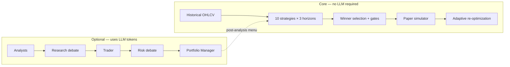

# CryptoTradingAgents

**Crypto research, backtesting, and paper trading** — with optional multi-agent LLM analysis.

TradingAgents is a crypto-only trading research platform. It runs a desk-style LLM pipeline (market, fundamentals, sentiment, news → debate → trader → risk → portfolio manager), optimizes **10 pure-code strategies** across **8h / 24h / 7d** horizons, and deploys winners into a **live paper simulator** with stop-loss, take-profit, adaptive re-optimization, and Kraken-first market data.

No equities. No yfinance. No real orders.

<div align="center">

[What it does](#what-it-does) · [Install](#installation) · [Quick start](#quick-start) · [CLI](#cli-reference) · [Backtesting](#backtesting) · [Paper trading](#paper-trading) · [Config](#configuration) · [Python API](#python-api)

</div>

> **Disclaimer:** Research and education only — not financial advice. Simulated trading does not guarantee live performance. See [Tauric disclaimer](https://tauric.ai/disclaimer/).

---

## What it does



| Layer | What you get |
|-------|----------------|
| **LLM research** | Multi-agent crypto analysis via LangGraph — configurable analysts, debate rounds, checkpoint/resume |
| **Backtest engine** | Intraday OHLCV, vectorized simulation, winner gating, walk-forward validation, ATR stops |
| **Paper trading** | Live spot prices, portfolio P&L, SL/TP, session persistence, drawdown watchdog |
| **Kraken integration** | ccxt + REST for OHLCV, live ticks, movers board, optional API key auth |

### Agent pipeline (optional)

| Stage | Agents | Role |
|-------|--------|------|
| Analysts | Market, Fundamentals, Sentiment, News | Perps/OHLCV, CoinGecko, LunarCrush/Reddit, crypto news |
| Research | Bull & Bear → Research Manager | Structured investment debate |
| Trading | Trader | Direction, timing, sizing proposal |
| Risk | Aggressive, Neutral, Conservative → PM | Stress-test and final approve/reject |

Built on **LangGraph** with parallel analyst fan-out (`analyst_concurrency_limit`). A programmatic risk guard can veto proposals that breach position, VaR, or concentration limits.

### Crypto data vendors

| Category | Default vendors | API key |
|----------|-----------------|---------|
| OHLCV (backtest) | ccxt Kraken → Coinbase → Binance → CryptoCompare | Optional `KRAKEN_API_KEY` |
| Live spot (paper) | CryptoCompare → ccxt → CoinGecko | Optional |
| Fundamentals | CoinGecko | `COINGECKO_API_KEY` optional |
| News & sentiment | CryptoCompare, LunarCrush, Reddit | Optional |
| Perps (funding, OI) | Binance public REST | None |
| 24h movers board | **Kraken tickers** (default) | None required |

**Pairs:** `BTC/USDT`, `ETH/USD`, `SOL/USDT`, etc. — normalized via `tradingagents/dataflows/symbol_utils.py`.

News and sentiment tools filter articles to the analysis date window (`date_window.py`) so agents never see future-dated headlines.

---

## Installation

**Requirements:** Python 3.10+

```bash
git clone https://github.com/TauricResearch/TradingAgents.git
cd TradingAgents
python -m venv .venv
source .venv/bin/activate   # Windows: .venv\Scripts\activate
pip install .
cp .env.example .env      # add keys (see Configuration)
```

**Docker:**

```bash
docker compose run --rm tradingagents
# Local Ollama:
docker compose --profile ollama run --rm tradingagents-ollama
```

**Run tests:**

```bash
pytest
```

---

## Quick start

Three entry points — use any combination:

### 1. Full LLM analysis (uses tokens)

```bash
tradingagents analyze
# or from source:
python -m cli.main analyze
```

Interactive wizard: pick pair, date, analysts, LLM provider, then run the full agent graph. After the Portfolio Manager report, a menu offers backtest and paper deploy.

### 2. Backtest only (zero LLM tokens)

```bash
tradingagents backtest --ticker BTC/USDT --date 2026-06-12 --no-interactive
```

Optimizes all 10 strategies across 8h, 24h, and 7d windows ending on the given date. Prints a ranked table and winner summary.

### 3. Paper trading (zero LLM tokens after initial backtest)

```bash
tradingagents paper --ticker BTC/USDT
```

Runs historical optimization, deploys the winner, then polls live prices in a Rich terminal UI.

**Fastest path to paper:**

```bash
tradingagents paper -t ETH/USDT --no-interactive --equity 10000
```

---

## CLI reference

```bash
tradingagents --help
tradingagents analyze --help
tradingagents backtest --help
tradingagents paper --help
```

### `analyze`

| Flag | Purpose |
|------|---------|
| `--checkpoint` | Save LangGraph state after each node (resume on crash) |
| `--clear-checkpoints` | Delete saved checkpoints before run |
| `--no-backtest` | Hide post-analysis backtest / paper menu |

### `backtest`

| Flag | Purpose |
|------|---------|
| `-t, --ticker` | Pair, e.g. `BTC/USDT` |
| `-d, --date` | End date `YYYY-MM-DD` |
| `--no-interactive` | Fail if required args missing (for scripts) |
| `--live` | Enable ccxt live-mode fallback |
| `--paper` | Chain into paper simulator after backtest |
| `--equity` | Starting equity when chaining to paper |

Bare `tradingagents backtest` on a TTY walks through pair, date, horizons, stop-loss, fees, and equity.

### `paper`

| Flag | Purpose |
|------|---------|
| `-t, --ticker` | Starting pair |
| `--strategy` | Skip optimization; use named strategy from registry |
| `--equity` | Starting portfolio USD |
| `--ticks N` | Run N price ticks then exit (default: until quit) |
| `--adaptive / --no-adaptive` | Drawdown-triggered re-optimization |
| `--live` | ccxt fallback when primary vendors fail |
| `--fresh` | Ignore saved session JSON |
| `--no-interactive` | Non-interactive mode |

### Post-analysis menu

After `analyze` (unless `--no-backtest`):

1. **Run Historical Optimization Backtest**
2. **Customize Backtest Horizon & Risk Parameters**
3. **Deploy Optimal Strategy to Paper Simulator**
4. Return to main menu / exit

### Demo script (`main.py`)

Single `propagate()` without the full CLI menu:

```bash
python main.py --ticker BTC/USDT --date 2026-06-12
export DEMO_TICKER=ETH/USDC DEMO_DATE=2026-06-12 && python main.py
```

---

## Backtesting

Pure-code engine — no LLM calls. Fetches intraday OHLCV, simulates entries/exits with fees and slippage, scores candidates, picks a winner.

### Data chain

1. **ccxt** exchanges (`BACKTEST_CCXT_EXCHANGES`, default `kraken,coinbase,binance`)
2. **Binance** klines
3. **CryptoCompare** (last resort; skip with `BACKTEST_SKIP_CRYPTOCOMPARE=1`)

Results cached under `~/.tradingagents/cache/historic_crypto/`. Crypto markets run **24/7** — no equity session gaps. Fetch failures raise `BacktestDataError` with per-vendor diagnostics (`TRADINGAGENTS_DEBUG=1` for traceback).

### Strategies

| ID | Registry name | Idea |
|----|---------------|------|
| A | `ema_crossover` | Fast vs slow EMA cross |
| B | `rsi_mean_reversion` | RSI oversold/overbought |
| C | `macd_crossover` | MACD vs signal line |
| D | `bollinger_mean_reversion` | Price vs Bollinger bands |
| E | `cmo_mean_reversion` | Chande Momentum extremes |
| F | `adx_trend_filter` | ADX + directional index |
| G | `vwap_band_mean_reversion` | VWAP volume-band re-entry |
| H | `cci_breakout` | CCI ±100 cross |
| I | `trix_momentum` | TRIX vs signal |
| J | `apo_crossover` | APO zero-line cross |

Registry: `tradingagents/backtest/strategies.py` → `STRATEGY_REGISTRY`.

### Optimization loop

`optimize_strategies(symbol, end_date)` runs every strategy across **8h**, **24h**, and **7d** lookbacks (5m / 15m / 1h bars). For each candidate:

1. Generate signals → apply filters → simulate with SL/TP
2. Score by net profit ratio or **composite** score (profit × PF / (1 + drawdown))
3. Apply **winner gates** (min profit, min trades, max drawdown)
4. Return best deployable `OptimizationResult`

```python
from tradingagents.backtest import optimize_strategies, deploy_winning_strategy, format_optimization_summary
from tradingagents.default_config import DEFAULT_CONFIG

result = optimize_strategies("BTC/USDT", "2026-06-12", config=DEFAULT_CONFIG)
result = deploy_winning_strategy(result, DEFAULT_CONFIG)
print(format_optimization_summary(result))
```

### Smart optimization profiles

`optimize_strategies()` auto-enriches config via `enrich_optimization_config()` — no extra flags needed.

**All symbols (BTC, ETH, alts):**

- ADX **regime filter** — mean-revert flat in trends, trend signals flat in chop
- **Min-edge filter** — skip entries when ATR move &lt; fees × multiplier
- **Trade cooldown** — 2 bars between re-entries
- **ATR-based stop-loss / take-profit** — per-entry sizing from volatility
- **Composite winner scoring**

**Majors (BTC, ETH):**

- 3 risk-knob variants (tight / default / wide ATR multiples)

**Midsize alts (everything else):**

- Per-strategy **parameter search** (12 random samples)
- **Walk-forward** train/validate split
- Expanded risk grid (4 ATR pairs × 2 fee levels)

Override via env — see [Optimizer flags](#optimizer--signal-quality-flags).

### Winner gating

Before auto-deploy, candidates must pass:

| Gate | Default |
|------|---------|
| Min net profit | 0% |
| Min trades | 3 |
| Max drawdown | 15% |

On adaptive re-backtest gate failure: `keep` current strategy or go `flat` (`TRADINGAGENTS_WINNER_ON_GATE_FAIL`).

---

## Paper trading

Simulated trading — **no exchange orders**. Signals: `1` = long, `-1` = short, `0` = flat.

### Live terminal UI

```
┌─ Activity log ─────────────────────────────────────┐
├─ Paper Trading ─────┬─ Market ─────────────────────┤
├─ Price Ticks (full width) ─────────────────────────┤
└─ (m) movers · (c) close & retest · (r) · (q) quit ┘
```

| Panel | Contents |
|-------|----------|
| **Activity** | Backtest progress, vendor attempts, entries/exits, adaptive rotations |
| **Paper Trading** | Strategy, signal, equity, P&L, drawdown, position |
| **Market** | Spot price, feed source, session H/L, tick timer, Kraken auth status, fees |
| **Price Ticks** | Rolling spot samples with Δ |

### Keyboard controls

| Key | Action |
|-----|--------|
| **m** | Toggle Kraken movers overlay |
| **esc** | Close movers overlay |
| **1–9** | Switch pair *(movers overlay only)* |
| **s** | Refresh movers *(movers overlay only)* |
| **c** | Close open position and re-run optimization |
| **r** | Re-analyze (re-optimize without closing position) |
| **q** | Quit (state saved) |

Movers load in the background — overlay opens instantly; data fills in when the Kraken fetch completes. Switching pairs carries equity forward and re-runs backtest on the new symbol.

### Tick evaluation

Each price poll (`evaluate_live_market_tick`):

1. **Mark to market** — update unrealized P&L
2. **Stop-loss** — exit when adverse move ≥ `stop_loss_pct` (default 2%)
3. **Take-profit** — exit when favorable move ≥ `take_profit_pct` (default 2× stop-loss)
4. **Signal** — enter, flip, or exit per strategy output

Winning backtest stores **median ATR-derived SL/TP** on the deployed session.

### Components

| Module | Role |
|--------|------|
| `VirtualPortfolio` | Cash, equity, long/short, fees |
| `SimulatedMatcher` | Market fills with slippage |
| `PaperTradingEngine` | Price polling, signal refresh, tick loop |
| `AdaptiveStrategyMonitor` | Drawdown watchdog; halts signals during re-test |
| `persistence.py` | JSON sessions at `~/.tradingagents/cache/paper_sessions/` |

### Price feed

`live_feed.py` chain: **CryptoCompare** → **ccxt** (Kraken/Coinbase/Binance) → **CoinGecko**. On 429/network errors, `dummy_feed` mutates from last anchor so the session keeps running.

Reorder ccxt with `BACKTEST_CCXT_EXCHANGES=kraken,coinbase,binance`.

### Pair-aware fees

Majors (BTC, ETH) use `TRADINGAGENTS_PAPER_TRANSACTION_COST_PCT` (default 0.1% per side). Alts multiply by `TRADINGAGENTS_PAPER_ALT_FEE_MULTIPLIER` (default 2×).

### Adaptive strategy switching

When `paper_adaptive_enabled` is on, sustained drawdown inside the review window triggers `optimize_strategies()` on a fresh slice. Signals halt during re-test. On swap:

```
[AUTONOMOUS ROTATION]: Strategy changed from [old] to [new] due to threshold violation.
```

Thresholds: `TRADINGAGENTS_MAX_ALLOWED_DRAWDOWN_PCT`, `TRADINGAGENTS_DRAWDOWN_TIME_WINDOW`, `TRADINGAGENTS_DRAWDOWN_MAX_LOOKBACK_MINUTES`.

### Python API

```python
from tradingagents.backtest import optimize_strategies, deploy_winning_strategy
from tradingagents.simulator import PaperTradingEngine, session_from_optimization
from tradingagents.default_config import DEFAULT_CONFIG

config = DEFAULT_CONFIG.copy()
config["paper_initial_equity"] = 10_000.0
config["paper_stop_loss_pct"] = 0.02
config["paper_take_profit_pct"] = 0.04  # None → 2× stop-loss

opt = deploy_winning_strategy(
    optimize_strategies("BTC/USDT", "2026-06-12", config=config),
    config,
)
session = session_from_optimization(opt, config)
engine = PaperTradingEngine(session, config)
engine.run_loop(max_ticks=10)
print(engine.get_state())
```

---

## Python API

### Multi-agent analysis

```python
from tradingagents.graph.trading_graph import TradingAgentsGraph
from tradingagents.default_config import DEFAULT_CONFIG

config = DEFAULT_CONFIG.copy()
config["llm_provider"] = "openai"
ta = TradingAgentsGraph(debug=True, config=config)
_, decision = ta.propagate("BTC/USDT", "2026-01-15", asset_type="crypto")
print(decision)
```

### Single-strategy backtest

```python
from tradingagents.backtest import run_strategy_backtest, LookbackWindow

result = run_strategy_backtest("SOL/USDT", "2026-01-15", lookback=LookbackWindow.H24)
print(result.total_return_pct, result.num_trades, result.win_rate)
```

### Custom strategy on a DataFrame

```python
from tradingagents.backtest import run_strategy_on_frame, build_strategy

df = ...  # OHLCV with Date, Open, High, Low, Close, Volume
strategy = build_strategy("rsi_mean_reversion", {"oversold": 30, "overbought": 70})
result = run_strategy_on_frame(df, strategy, stop_loss_pct=0.02, transaction_cost_pct=0.001)
```

---

## Configuration

Copy `.env.example` → `.env`. Every `TRADINGAGENTS_*` variable in `.env.example` maps to `default_config.py` via `_ENV_OVERRIDES` — types are coerced automatically.

### LLM providers

| Provider | `TRADINGAGENTS_LLM_PROVIDER` | API key env |
|----------|------------------------------|-------------|
| OpenAI | `openai` | `OPENAI_API_KEY` |
| Anthropic | `anthropic` | `ANTHROPIC_API_KEY` |
| Google | `google` | `GOOGLE_API_KEY` |
| AtlasCloud | `atlascloud` | `ATLASCLOUD_API_KEY` |
| Local OpenAI-compatible | `local` | `LOCAL_LLM_API_KEY` + `LOCAL_LLM_BASE_URL` + `LOCAL_LLM_MODEL_NAME` |

Also supported: xAI, DeepSeek, OpenRouter, DashScope, Zhipu, MiniMax, Azure OpenAI (see `.env.example`).

**Local LLM quick start** (Ollama, LM Studio, vLLM):

```bash
LOCAL_LLM_BASE_URL=http://localhost:11434/v1
LOCAL_LLM_API_KEY=ollama
LOCAL_LLM_MODEL_NAME=qwen3:latest
TRADINGAGENTS_LLM_PROVIDER=local
```

### Kraken (recommended for paper)

```bash
KRAKEN_API_KEY=your_key
KRAKEN_API_SECRET=your_secret
```

Create at [kraken.com/u/security/api](https://www.kraken.com/u/security/api) with **Query** permissions only for paper use. Public OHLCV and movers work without a key.

Market panel shows `authenticated` when the key validates.

### Movers board

```bash
TRADINGAGENTS_MOVERS_PROVIDER=kraken          # default; no CoinGecko key needed
TRADINGAGENTS_MOVERS_MIN_VOLUME_USD=250000
TRADINGAGENTS_MOVERS_DISPLAY_LIMIT=5
TRADINGAGENTS_MOVERS_CACHE_TTL_SECONDS=300
```

### Paper trading

```bash
TRADINGAGENTS_PAPER_INITIAL_EQUITY=10000
TRADINGAGENTS_PAPER_TICK_INTERVAL_SECONDS=3
TRADINGAGENTS_PAPER_STOP_LOSS_PCT=0.02
TRADINGAGENTS_PAPER_TAKE_PROFIT_PCT=0.04      # unset → 2× stop-loss
TRADINGAGENTS_PAPER_ADAPTIVE_ENABLED=true
TRADINGAGENTS_MAX_ALLOWED_DRAWDOWN_PCT=5.0
TRADINGAGENTS_DRAWDOWN_TIME_WINDOW=60
TRADINGAGENTS_PAPER_TRANSACTION_COST_PCT=0.001
TRADINGAGENTS_PAPER_ALT_FEE_MULTIPLIER=2.0
TRADINGAGENTS_PAPER_STATE_ENABLED=true
```

### Backtest & data

```bash
BACKTEST_CCXT_EXCHANGES=kraken,coinbase,binance
BACKTEST_CACHE_TTL_SECONDS=600
BACKTEST_SKIP_CRYPTOCOMPARE=0
TRADINGAGENTS_DEBUG=1                         # verbose backtest errors
```

### Winner gates

```bash
TRADINGAGENTS_WINNER_GATE_ENABLED=true
TRADINGAGENTS_WINNER_MIN_NET_PROFIT=0.0
TRADINGAGENTS_WINNER_MIN_TRADES=3
TRADINGAGENTS_WINNER_MAX_DRAWDOWN_PCT=0.15
TRADINGAGENTS_WINNER_SCORE_MODE=composite    # or net_profit
TRADINGAGENTS_WINNER_ON_GATE_FAIL=keep       # or flat
```

### Optimizer & signal-quality flags

Applied automatically by `optimize_strategies()` unless overridden:

```bash
TRADINGAGENTS_ATR_STOPS_ENABLED=true
TRADINGAGENTS_MIN_EDGE_FILTER_ENABLED=true
TRADINGAGENTS_MIN_EDGE_FEE_MULTIPLE=3.0
TRADINGAGENTS_REGIME_FILTER_ENABLED=true
TRADINGAGENTS_MIN_BARS_BETWEEN_TRADES=2
TRADINGAGENTS_MAJOR_RISK_VARIANTS_ENABLED=true
TRADINGAGENTS_ALT_AUTO_RICH_OPTIMIZATION=true
TRADINGAGENTS_ALT_PARAM_SEARCH_SAMPLES=12
TRADINGAGENTS_ALT_WALK_FORWARD_ENABLED=true
TRADINGAGENTS_ALT_EXPAND_RISK_VARIANTS=true
```

Manual deep sweeps (slower):

```bash
TRADINGAGENTS_OPTIMIZE_RISK_PARAMS=true       # full SL/TP/fee grid
TRADINGAGENTS_OPTIMIZE_STRATEGY_PARAMS=true
TRADINGAGENTS_WALK_FORWARD_ENABLED=true
TRADINGAGENTS_PARAM_SEARCH_SAMPLES=20
```

Full list: `tradingagents/default_config.py` and `.env.example`.

---

## Project layout

```
TradingAgents/
├── cli/                    # Typer CLI, paper UI, movers board, activity log
├── tradingagents/
│   ├── agents/             # LLM agent definitions
│   ├── backtest/           # Engine, strategies, optimization, walk-forward
│   ├── dataflows/          # Kraken, Binance, CoinGecko, live feed, movers
│   ├── graph/              # LangGraph orchestration
│   ├── llm_clients/        # Provider adapters
│   ├── risk/               # Programmatic risk guard
│   └── simulator/          # Paper engine, portfolio, persistence
├── tests/
├── .env.example
└── pyproject.toml
```

---

## Persistence & recovery

| Artifact | Location | When |
|----------|----------|------|
| Decision log | `~/.tradingagents/memory/trading_memory.md` | Always (LLM runs) |
| OHLCV cache | `~/.tradingagents/cache/historic_crypto/` | Backtests |
| Paper sessions | `~/.tradingagents/cache/paper_sessions/` | Paper trading |
| LangGraph checkpoints | `~/.tradingagents/cache/checkpoints/<TICKER>.db` | `--checkpoint` |

Override paths: `TRADINGAGENTS_CACHE_DIR`, `TRADINGAGENTS_MEMORY_LOG_PATH`, `TRADINGAGENTS_RESULTS_DIR`.

---

## Reproducibility

- **Backtest / paper math** — deterministic given the same OHLCV cache and price feed
- **LLM runs** — non-deterministic (sampling, reasoning models, live news). Lower `TRADINGAGENTS_TEMPERATURE` for tighter repeatability; identical output across runs is not guaranteed

---

## Contributing

Bug fixes, docs, and features welcome. See [`CHANGELOG.md`](CHANGELOG.md), [`PLAN.md`](PLAN.md), and [`PLAN-IMPROVE.md`](PLAN-IMPROVE.md).

```bash
pytest                    # full suite
pytest tests/test_kraken.py -q
```

---

## Citation

```bibtex
@misc{xiao2025tradingagentsmultiagentsllmfinancial,
      title={TradingAgents: Multi-Agents LLM Financial Trading Framework},
      author={Yijia Xiao and Edward Sun and Di Luo and Wei Wang},
      year={2025},
      eprint={2412.20138},
      archivePrefix={arXiv},
      primaryClass={q-fin.TR},
      url={https://arxiv.org/abs/2412.20138},
}
```
